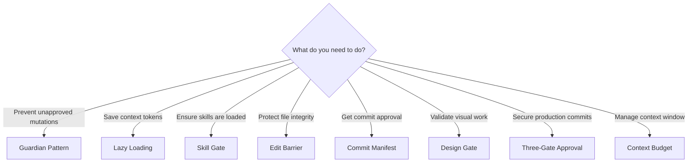
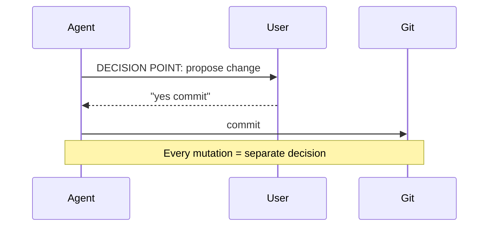
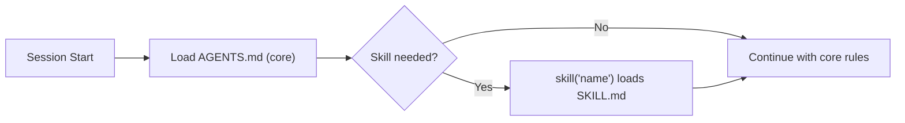
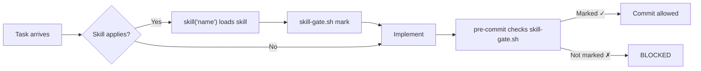
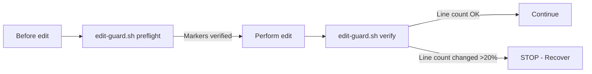
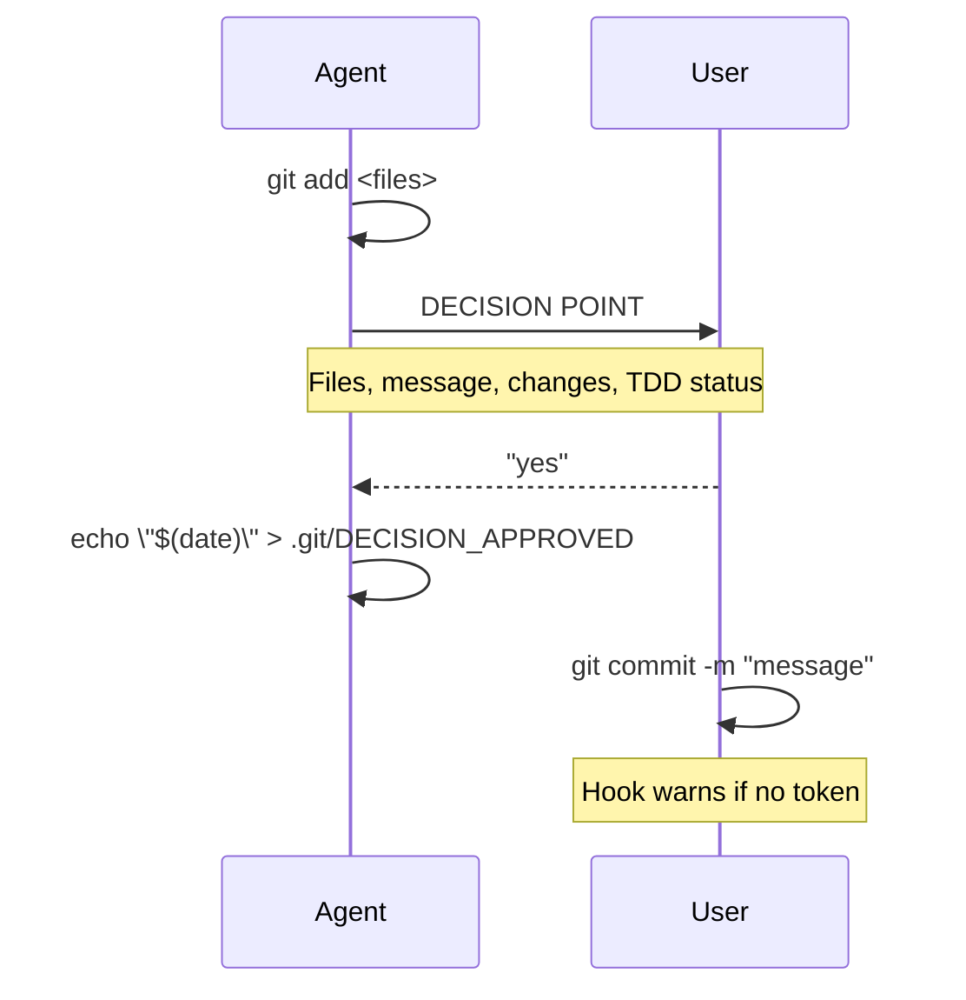
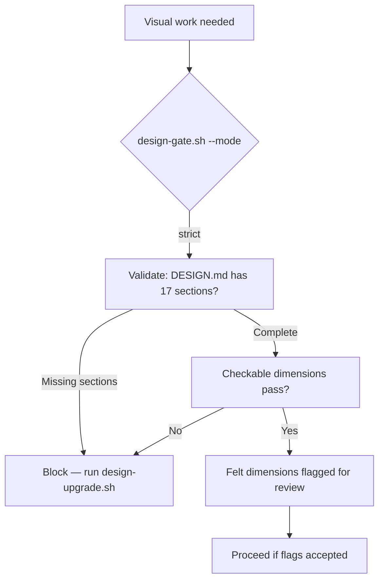
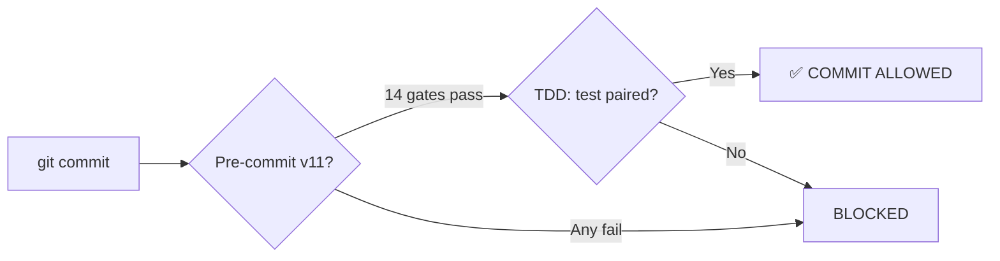
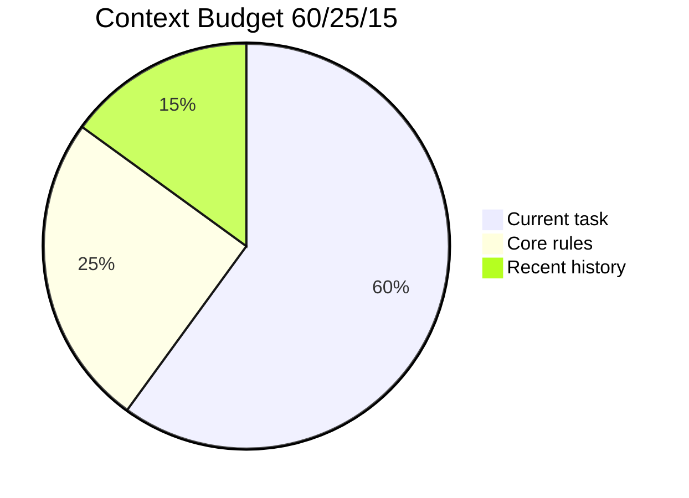

# Patterns — Agent Workflow Engineering

> Quick-reference catalog of agent workflow patterns with use cases, trade-offs, and diagrams.
> For anti-patterns, see `ANTI-PATTERNS.md`. For full rule reference, see `AGENTS-EXTENDED.md`.

---

## Pattern Selection Guide

---

## Pattern Catalog

### Guardian Pattern

**Trigger:** Before any git mutation (commit, push, merge, rebase).

**Trade-off:** Safety vs speed. The gate adds friction to every mutation but prevents unapproved changes.

**Description:** The meta-pattern that governs all git operations. Before every mutation, the agent must present a DECISION POINT block and receive explicit user approval. No batch-mode commits, no implied consent.

**Implementation:**
- Rule 12 in `rules/common/enforcement.md`
- `scripts/commit-approval.sh` writes time-windowed approval token
- `scripts/git-hooks/commit-msg` v4 validates TDD gate

**See also:** Rule 12, `AGENTS-EXTENDED.md` — Commit Manifest Protocol

---

### Lazy Loading

**Trigger:** A skill file exceeds ~100 lines, or a skill is not immediately needed.

**Trade-off:** Context efficiency vs load latency. Skills are loaded on-demand, saving ~45% of always-loaded tokens.

**Description:** Skills are kept as compact ~250-line indexes. Detailed guides are stored as separate files and loaded only when the `skill()` tool is invoked. This is the architecture that keeps context windows manageable across long sessions.

**Implementation:**
- Rule 6 in `rules/common/context.md`
- SKILL.md as index (≤250 lines), guides as separate files
- `skill()` tool or direct read of `skills/<name>/SKILL.md`

**See also:** Rule 6, Rule 0e (Context Budget)

---

### Skill Gate

**Trigger:** Before any implementation or code generation.

**Trade-off:** Discipline vs friction. Forces skill consultation before implementation, preventing "just code it" shortcuts.

**Description:** A mechanical gate (`scripts/skill-gate.sh`) that creates a filesystem marker when a skill is loaded. The pre-commit hook verifies the marker exists before allowing commits. Without it, agents implement directly without consulting skills.

**Implementation:**
- `scripts/skill-gate.sh` — mark, check, reset
- Pre-commit hook — gate checks marker
- Created after INCIDENT_004 (implementation without skills)

**See also:** Rule 1, `AGENTS-EXTENDED.md` — Skill Gate Enforcement

---

### Edit Barrier

**Trigger:** Before and after every file edit via `edit()` or `write()` tool.

**Trade-off:** Prevention vs overhead. Adds ~2s per edit for verification but prevents file corruption and structural damage.

**Description:** A protocol (`scripts/edit-guard.sh`) that verifies file integrity at edit boundaries. Pre-flight checks that the file exists and structural markers are present. Post-flight verifies line count hasn't changed unexpectedly and markers remain intact.

**Implementation:**
- `scripts/edit-guard.sh preflight <file> <markers>`
- `scripts/edit-guard.sh verify <file>`
- Line count delta check (>20% = BLOCKING)

**See also:** Rule 0d, `AGENTS-EXTENDED.md` — Edit Guard Protocol

---

### Commit Manifest

**Trigger:** Before every `git commit`.

**Trade-off:** Audit trail vs fluency. Every commit requires a visible manifest, but produces a verifiable audit trail.

**Description:** A structured block presented to the user before every commit, listing files changed, line counts, commit message, and a Rule 12 checklist. The user must type "yes commit" to proceed. Invalid responses ("ok", "dale") are rejected.

**Implementation:**
- `rules/common/enforcement.md` — Rule 12: Agent Stages, User Commits
- `scripts/project-pre-commit` — DECISION_APPROVED check (warning)
- `scripts/git-hooks/commit-msg` — TDD gate enforcement (no override)

**See also:** Rule 12, `AGENTS-EXTENDED.md` — Time-Window Approval

---

### Design Gate

**Trigger:** Before any visual or design work (CSS, components, layouts).

**Trade-off:** Consistency vs agility. Requires design intent to be documented before implementation, preventing aimless visual iteration.

**Description:** A mechanical gate (`scripts/design-gate.sh`) that validates design system completeness against the 17-section DESIGN.md schema. Three modes: `--strict` (blocks new projects on incomplete contracts), `--audit` (warns on existing projects), `--verify` (pre-merge drift detection). Split into automated blocks (checkable dimensions like tokens, contrast, breakpoints) and human review flags (felt dimensions like harmony, mood).

**Implementation:**
- `scripts/design-gate.sh` — 3-mode schema validation
- `scripts/token-validate.sh` — CSS drift detection (called by --verify)
- `scripts/design-upgrade.sh` — auto-extract missing sections

**See also:** Rule 0d (Design Gate), `SOUL.md` Principle 1, `DESIGN-MD-SCHEMA.md`

---

### Single-Gate TDD

**Trigger:** Every `git commit`.

**Trade-off:** Simplicity vs ceremony. A single TDD gate enforces test coverage without blocking velocity. The user running `git commit` IS the approval.

**Description:** The commit-msg hook v6 validates a single TDD gate: code changes must be paired with corresponding test changes. All other approval checks were removed. Pre-commit v11 (14 gates) handles quality checks before the message is written.

**Implementation:**
- `scripts/git-hooks/pre-commit` — 14 quality gates (v11)
- `scripts/git-hooks/commit-msg` — single TDD gate (v4)
- User stages + runs `git commit` directly — no token, no hash, no friction

**See also:** Rule 12, `scripts/git-hooks/commit-msg`

---

### Context Budget (60/25/15)

**Trigger:** Session messages exceed 20 turns or context approaches capacity.

**Trade-off:** Retention vs capacity. Active work is preserved, history is compressed.

**Description:** The allocation strategy for context window: 60% current task (instructions, code under edit), 25% core rules (AGENTS.md summary), 15% recent conversation history. Compaction is triggered when messages exceed 20 turns, and it never evicts active work artifacts.

**Implementation:**
- Rule 0e in `rules/common/context.md`
- Compaction at >20 messages
- Lazy loading (Rule 6) keeps skills out of baseline context

**See also:** Rule 0e, Rule 6 (Lazy Loading), `context-engineering` skill

---

## Summary

| Pattern | Trigger | Primary Gate | Risk without it |
|---|---|---|---|
| Guardian Pattern | Before any mutation | commit-msg hook v6 | Unapproved changes in repo |
| Lazy Loading | Skill > 100 lines | skill-lint.sh Check 6 | Context saturation at message 8 |
| Skill Gate | Before implementation | pre-commit hook | Implementation without process |
| Edit Barrier | Before/after each edit | edit-guard.sh | Corrupted or truncated files |
| Commit Manifest | Before each commit | commit-approval.sh | Batch-mode, unapproved commits |
| Design Gate | Visual/design work | design-gate.sh | Undocumented visual decisions |
| Single-Gate TDD | Every commit | commit-msg v6 | Missing tests or approval |
| Context Budget | >20 messages | Manual compaction | Degraded output quality |

---

*See [ANTI-PATTERNS.md](./ANTI-PATTERNS.md) for what happens when these patterns are ignored.*
*See [AGENTS-EXTENDED.md](./AGENTS-EXTENDED.md) for the full rule reference.*
