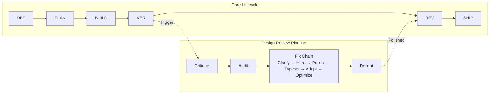

# Another Agent Skills

[](./LICENSE)
[](./RELEASE-NOTES.md)
[](./CONTRIBUTING.md)
[](./PROGRESS_STATUS.md)

**41 composable skills + 6 harness components that turn AI coding agents into disciplined senior engineers.**
**No bloat. No shortcuts. Just process. Harness. Repeat.**

Define → Plan → Build → Verify → Review → Ship. Every time.

> Designed for [**OpenCode**](https://opencode.ai) first. Portable to Claude Code, Cursor, Kiro, and any agent via [`docs/AGENT-ADAPTERS.md`](./docs/AGENT-ADAPTERS.md).

---

## Quick Start

### Linux / macOS

```bash
git clone https://github.com/juandelossantos/another-agent-skills.git
cd another-agent-skills
bash install.sh          # Installs skills globally
init-agents              # In any project: activates skill-driven mode
```

### Windows (PowerShell)

```powershell
git clone https://github.com/juandelossantos/another-agent-skills.git
cd another-agent-skills
.\install.ps1            # Installs skills globally
init-agents              # In any project: activates skill-driven mode
```

**That's it.** Your AI agent now has 41 custom skills + 47 guides + 6 harness components.
The installer detects your shell (Zsh, Bash, Fish, PowerShell) and configures it automatically.

Run `init-agents` in every new project — it:
- Merges AGENTS.md without overwriting existing rules
- Links framework files (rules, scripts, SOUL.md) from global installation
- Detects your stack and creates `STACK_CONFIG.md`
- Installs lifecycle enforcement hook (tests, build, secrets)
- Installs CI pipeline (reads STACK_CONFIG.md)
- Creates `.sessionrc` for purpose-driven sessions

> **Safety:** Backs up before replacing. `init-agents` merges — never overwrites.
> **Universal:** Works with Node, Rust, Python, Go, Ruby, Dart, or any stack.
> **Agent adapters:** `bash install.sh --agent claude` or `.\install.ps1 -Agent claude`

---

## Commands

After installation, these commands are available in your terminal:

| Command | What It Does |
|---|---|
| `init-agents` | Activates skill-driven mode in any project. Merges rules, links framework files. |
| `update-global-skills` | Pulls latest skills from upstream (`addyosmani/agent-skills`). |
| `bash install.sh` | Full installer: 41 skills, shell config, global scripts. |
| `bash uninstall.sh` | Removes shell config, scripts, and installed skills. |

These are **project commands** you run in your terminal. They are NOT skills — skills are what the agent loads automatically when it detects a matching task.

---

## What Makes This Different

Most agent skill frameworks give you a library of prompts. This one gives you an engineering discipline — with mechanical enforcement, not just suggestions.

### Six Layers Beyond Prompts

**1. SOUL.md — Portable Agent Identity** — A single document that defines who the agent is, what it believes, and what it never does. Travels across projects and sessions. Not just rules — a philosophy.

**2. The Harness (Mechanical Enforcement)** — Agent = Model + Harness. Six components (instructions, tools, sandboxes, orchestration, guardrails, observability) documented in [`docs/HARNESS.md`](./docs/HARNESS.md). Pre-commit v8 with 9 gates: branch check, staged changes, remote sync, HTML integrity, skill gate, build verification, anti-slop detection (10 patterns), debug 3-strikes tracking, SPEC enforcement, PROGRESS STATUS validation (`validate-skill-table.sh`), skill-lint. Token validation handled by commit-msg hook (v4). No other framework does this.

**3. Guardian Pattern** — Before any mutation (commit, push, merge, rebase), the agent must present a DECISION POINT block, explain rationale, and wait for explicit approval. Invalid responses like "ok" and "continue" are rejected. Plan approval ≠ commit approval — always separate decisions.

**4. Context Engineering** — Lazy loading: skills are ~250-line indexes; detailed guides load only on-demand. Result: ~3,870 tokens always-loaded (1.9% of 200K) vs ~7,965 in eager mode (50% savings). Auto-eviction at 70% context usage.

**5. Stack-Agnostic Universal System** — `init-agents` detects your stack (Node, Rust, Python, Go, Ruby, Dart, or unknown) and creates `STACK_CONFIG.md` with your actual commands. CI, hooks, and skills all read from this file. Works for any project, not just specific frameworks.

**6. Process Discipline** — User-gated commits with mandatory manifest (approve-commit.sh). PR Review Gate. 25-entry anti-rationalization table. Debug 3-strikes escalation. Mayéutic Challenge (agents that push back). Incident-driven enforcement evolution.

### Context Budget

| System | Always-loaded | Lazy loading | Guides | Context control |
|--------|--------------|--------------|--------|-----------------|
| Raw SKILL.md files | ~7,965 tokens | No | Inline | None |
| **Another Agent Skills** | **~3,870 tokens** | Yes, on-demand | Yes, 47 guides | Auto-evict at 70% |

---

## What's New in v1.11.0

- **Harness Edition** — Agent = Model + Harness. Full architecture documented in [`docs/HARNESS.md`](./docs/HARNESS.md): 6 components (instructions, tools, sandboxes, orchestration, guardrails, observability)
- **SOUL.md principles 9 & 10** — "Generation is solved. Verification, judgment, and direction are the new craft." + "Agent = Model + Harness. Most agent failures are configuration failures."
- **AI-Generated Code Review Checklist** — 8 specific failure-mode checks for code produced by AI agents (hallucinated dependencies, superficial error handling, over-engineering)
- **Memory.md ×2** — engineering-fundamentals (harness configuration failure incidents) + backend-api-mastery (AI API antipatterns)
- **Landing page reframed** — "Enforcement" → "The Harness". Updated i18n EN/ES with harness terminology, vibe coding debt, FAQ q8-q10, paper reference
- **Docs enforcement page** — Added Harness Architecture section, gate 9 (PROGRESS_STATUS validation), Spanish translations

## What's New in v1.10.0

- **Progress validation gate** — `validate-skill-table.sh` runs in pre-commit hook v8, blocking commits where PROGRESS_STATUS.md skill table doesn't match disk state
- **Steering file** — PROGRESS_STATUS.md promoted to 🟡 HIGH severity steering file, scanned on session start
- **Inventory accuracy** — 7 upstream-only skills separated from 41 project-owned. Contradictory summary eliminated
- **Shell scripts executable** — `install.ps1` and `scripts/project-pre-commit` fixed to 755

## What's New in v1.9.0

- **Framework distribution** — `install.sh` now copies rules, scripts, SOUL.md, AGENTS-EXTENDED.md, and VERSION to `~/.config/opencode/`
- **Smart symlinks** — `init-agents` links framework files from global installation to your project (never overwrites local files)
- **Complete framework** — Running `init-agents` now delivers 12 linked files: rules, enforcement scripts, identity, and version
- **Status report** — Clear INSTALLED/LINKED/SKIPPED/MISSING output so you know exactly what's set up
- **Idempotent** — Re-running `init-agents` is safe. Symlinks are reused, local files preserved

## What Was New in v1.8.0

- **Mayéutic enforcement** — Task manifest system: agent must write manifest before executing non-trivial tasks
- **Evals.md** — Pass/fail checks for test-driven-development, code-review-and-quality, spec-driven-development
- **Memory.md** — Learning log for debugging-and-error-recovery skill
- **Conflict detection** — Doubt-driven development now checks for rule conflicts
- **Level 4 enforcement** — Manifest gate added to landing page
- **Documentation system** — 51 pages: 10 main docs + 41 individual skill pages
- **Bilingual docs** — Full EN/ES support with language toggle

- **TOOL_GAP verdict** — When verification tools can't reach the world, report "ship status unknown." Never fake a win. Inspired by Sub-Zero Skill.
- **Severity labels** — 6-level code review classification: 🔴 blocking → 🟠 important → 🟡 nit → 🔵 suggestion → 📚 learning → 🌟 praise. Inspired by awesome-skills/code-review-skill.
- **Error path design** — "Error paths are main paths." Every tool call, gate, loop, and session needs a failure path. Inspired by Harness Books.
- **Drift detection** — Docs vs reality consistency checks (stats, version, features, commands, links). Inspired by Sub-Zero Skill.
- **Continuation over recap** — After context loss, resume from last verified state. Don't recap everything. Inspired by Harness Books.
- **3 forked skills** — doubt-driven-development, shipping-and-launch, context-engineering: trimmed to ≤250 lines, added TOOL_GAP, now part of our project.
- **Mandatory manifest gate** — Agent cannot generate approval tokens without writing a commit manifest first.

> "Ship an API" → loads `backend-api-mastery` → protocol decision → DB schema → endpoints → tests.
> "Fix a bug" → loads `debugging-and-error-recovery` → repro test → root cause → fix → verify.
> "Review a PR" → runs `pr-review-checklist.sh` → verifies mechanical gates → merge.
> Every task has a defined process, every mutation has a decision point. No guessing.

---

## Development Lifecycle



Every task starts at **Define** and moves through the pipeline. The **Design Review Pipeline** is triggered after Verify — it runs critique → audit → fix → delight before shipping.

## Skills at a Glance

| Skill | When | What It Does |
|---|---|---|
| `engineering-fundamentals` | Foundation | Universal engineering philosophy: discovery protocols, contract-first design, anti-slop detection (25 patterns), quality gates, Three Dials design core, pre-flight enforcement, context eviction. Implicitly loaded by every skill. |
| `backend-api-mastery` | API/backend | REST/GraphQL, DB, auth, testing, docs |
| `spec-driven-development` | New features | Research-backed specs with critical thinking |
| `architecture-analysis` | Stack decisions | 2-3 options evaluated with trade-offs |
| `git-init-and-versioning` | Project setup | Git init, .gitignore, branching, pre-commit gates |
| `fullstack-shipping` | Deploy/go-live | CI/CD, monitoring, rollback, launch checklist |
| `project-health-check` | Existing code | Full codebase audit before new work + drift detection |
| `dev-environment-audit` | Before build | MCPs, CLI tools, runtime verification |
| `user-onboarding` | First session | 30 preferences asked once, persisted forever |
| `project-metrics` | Background | Build pass rate, rework, coverage logging |
| `multi-agent-orchestration` | >2 agents | Parallel/pipeline/swarm patterns with `task` tool |
| `cli-tools` | Build a CLI | arg parsing, exit codes, colors, progress bars |
| `doubt-driven-development` | High-stakes decisions | Fresh-context adversarial review, 3 cycles max |
| `shipping-and-launch` | Deploy | Pre-launch checklist, monitoring, rollback, TOOL_GAP |
| `context-engineering` | Session setup | Context hierarchy, packing strategies, continuation-over-recap |

**Design platform skills →** See [`docs/DESIGN-SKILLS.md`](./docs/DESIGN-SKILLS.md) for the full design ecosystem: 21 platform and review skills including frontend-web, frontend-mobile, industrial-brutalist-ui, the 9-skill design review pipeline (critique → audit → fix → delight), and more.

## Design Review Pipeline

The pipeline turns subjective design feedback into a deterministic, measurable process. Each skill handles one dimension, and together they cover the full quality spectrum.

| Skill | Dimension | Strength | Typical Score |
|---|---|---|---|
| `critique-skill` | Design quality | Heuristic review (Nielsen 10, 4 personas), AI slop detection, LLM + automated passes | 0-4 per heuristic |
| `audit-skill` | Technical quality | 5-dimension scan: a11y, perf, theming, responsive, anti-patterns. P0-P3 severity | 0-4 per dimension |
| `clarify-skill` | UX copy | Rewrites labels, errors, buttons, empty states, confirmations. Voice-tuned per audience | 8 QA gates |
| `hard-skill` | Accessibility & robustness | Mechanical P0/P1 fixes: ARIA, keyboard nav, validation, error/empty/loading states | Traces to audit |
| `polish-skill` | Design details | Fixes spacing, alignment, token drift, border radius, shadows. No design decisions | Token compliance |
| `typeset-skill` | Typography | Applies type ramp, fixes line-height, letter-spacing, paragraph rhythm | 8 QA gates |
| `adapt-skill` | Responsive layout | Breakpoints, touch targets (≥44px), viewport, mobile overflow | 9 QA gates |
| `optimize-skill` | Performance | Bundle size, lazy loading, image optimization, animation compositing, layout thrashing | Lighthouse ≥90 |
| `delight-skill` | Micro-interactions | Hover/tap feedback, state transitions, loading animation, success/error feedback | 9 QA gates |

**Typical flow:** critique highlights design gaps → audit finds technical issues → clarify/hard/polish/typeset/adapt/optimize fix them → delight adds the polish. All skills are cross-platform and stack-agnostic.

---

## Agent Compatibility

Another Agent Skills works with multiple AI coding agents. **Git hooks work everywhere.** Skill concepts (TOOL_GAP, severity labels, error paths) load automatically for OpenCode; other agents need manual setup.

### What Works Where

| Feature | OpenCode | Claude Code | Cursor | Kiro | Any Git Agent |
|---|---|---|---|---|---|
| Git hooks (pre-commit, commit-msg) | ✅ auto | ✅ auto | ✅ auto | ✅ auto | ✅ auto |
| Manifest gate (approve-commit.sh) | ✅ auto | ✅ auto | ✅ auto | ✅ auto | ✅ auto |
| SOUL.md (philosophy, principles) | ✅ auto | ⚠️ manual | ⚠️ manual | ⚠️ manual | ⚠️ manual |
| AGENTS.md (rules, lifecycle) | ✅ auto | ⚠️ manual | ⚠️ manual | ⚠️ manual | ⚠️ manual |
| SKILL.md concepts (TOOL_GAP, severity) | ✅ auto | ⚠️ manual | ⚠️ manual | ⚠️ manual | ⚠️ manual |
| Stack detection (STACK_CONFIG.md) | ✅ auto | ✅ auto | ✅ auto | ✅ auto | ✅ auto |
| i18n (EN/ES) | ✅ auto | ❌ N/A | ❌ N/A | ❌ N/A | ❌ N/A |

**auto** = works out of the box after `install.sh` + `init-agents`
**manual** = requires copying rules into agent-specific config files

### Setup per Agent

#### OpenCode (Recommended)

No extra setup. Skills load automatically via the skill tool.

```bash
bash install.sh          # Installs skills globally
cd your-project
init-agents              # Activates in this project
```

#### Claude Code

```bash
bash install.sh --agent claude
```

This creates `.claude-plugin/agent-discipline/` with hooks. To also load SOUL.md and AGENTS.md rules:

```bash
# Copy rules into Claude's config
cp SOUL.md .claude/CLAUDE.md.append
cp AGENTS.md .claude/CLAUDE.md.append
# Or manually add the key principles to your existing CLAUDE.md
```

**Key principles to add to CLAUDE.md:**
- Rule 0h: TOOL_GAP — report "ship status unknown" when tools can't verify
- Rule 0i: Continuation Over Recap — resume, don't recap after context loss
- Principle 8: Verification without evidence is inspection
- Severity labels: 🔴 blocking → 🟠 important → 🟡 nit → 🔵 suggestion → 📚 learning → 🌟 praise

#### Cursor

```bash
bash install.sh --agent cursor
```

This creates `.cursor-plugin/agent-discipline/` with hooks. To load rules:

```bash
# Add rules to .cursorrules
cat SOUL.md AGENTS.md >> .cursorrules
# Or manually add key principles
```

#### Kiro

```bash
bash install.sh --agent kiro
```

This creates `.kiro/hooks/agent-discipline.json` with pre-flight, commit approval, and edit guard hooks.

#### Any Git-Based Agent

The git hooks work with any agent that uses git:

```bash
# Copy hooks to your project
cp scripts/git-hooks/pre-commit .git/hooks/pre-commit
cp scripts/git-hooks/commit-msg .git/hooks/commit-msg
chmod +x .git/hooks/pre-commit .git/hooks/commit-msg

# Copy the approval script
cp scripts/approve-commit.sh scripts/
```

The hooks enforce: pre-flight checks, skill consultation, build verification, anti-slop, debug tracking, commit approval with mandatory manifest.

### Using Principles in Your Own System

The core principles are agent-agnostic. You can adopt them anywhere:

| Principle | How to Use |
|---|---|
| **TOOL_GAP** | When your verification tools can't reach the world, report "ship status unknown." Never fake success. |
| **Severity Labels** | Classify review findings: blocking → important → nit → suggestion → learning → praise. |
| **Error Path Design** | Every tool call, gate, and loop needs a failure path designed at build time. |
| **Continuation Over Recap** | After context loss, resume from last known state. Don't waste tokens re-explaining. |
| **Drift Detection** | Check docs vs reality regularly. Stats, versions, features, commands, links. |
| **Manifest Gate** | Require a written summary of changes before any commit approval. |

See [`docs/AGENT-ADAPTERS.md`](./docs/AGENT-ADAPTERS.md) for full adapter documentation.

---

## How to Use

### New Project

```bash
init-agents          # Creates AGENTS.md + .sessionrc with purpose
# Then start working. The agent loads the matching skill automatically.
```

### Existing Project

```bash
init-agents          # Merges skills into existing AGENTS.md or CLAUDE.md — never overwrites
```

### Pre-Flight Check

Before any edit in this repo:

```bash
bash scripts/pre-flight.sh
```

Checks: correct branch, clean working tree, remote up to date, upstream configured.
If it fails, ask the user before taking any action.

---

## Documentation Map

| File | What It Is |
|---|---|
| [`AGENTS.md`](./AGENTS.md) | Core rules: context persistence, intent mapping, lifecycle, mutation approval |
| [`AGENTS-EXTENDED.md`](./AGENTS-EXTENDED.md) | Full anti-rationalization table, Commit Manifest Protocol, project-type matrix |
| [`SOUL.md`](./SOUL.md) | Project identity: principles, values, what we never do |
| [`EXAMPLES.md`](./EXAMPLES.md) | Before/after skill usage demonstrations |
| [`docs/HARNESS.md`](./docs/HARNESS.md) | Harness architecture: 6 components, Agent = Model + Harness |
| [`docs/DESIGN-WORKFLOW.md`](./docs/DESIGN-WORKFLOW.md) | Design ecosystem map: skills, lifecycle, decision tree, review pipeline |
| [`docs/DESIGN-SKILLS.md`](./docs/DESIGN-SKILLS.md) | All design-related skills: platforms, skins, review pipeline |
| [`docs/AGENT-ADAPTERS.md`](./docs/AGENT-ADAPTERS.md) | Agent compatibility, adapter setup, per-agent configuration |
| [`docs/EXAMPLES.md`](./docs/EXAMPLES.md) | Full 366-line before/after reference |
| [`PROGRESS_STATUS.md`](./PROGRESS_STATUS.md) | Project state, roadmap, and phased completion |
| [`RELEASE-NOTES.md`](./RELEASE-NOTES.md) | Changelog and version history (current: v1.11.0) |
| [`HEALTH-CHECK.md`](./HEALTH-CHECK.md) | Project health audit (41 skills, 0 lint warnings) |
| [`DEVELOPMENT.md`](./DEVELOPMENT.md) | Maintainer conventions and artifact rules |
| [`STACK_CONFIG_TEMPLATE.md`](./STACK_CONFIG_TEMPLATE.md) | Stack-agnostic configuration template |
| [ADRs/](./ADRs/) | Architecture Decision Records |
| [`scripts/pre-flight.sh`](./scripts/pre-flight.sh) | Pre-action git state check |
| [`scripts/git-hooks/pre-commit`](./scripts/git-hooks/pre-commit) | Pre-commit hook v8 (9 gates) |
| [`scripts/git-hooks/commit-msg`](./scripts/git-hooks/commit-msg) | Commit-msg hook v4 (token validation + deletion) |
| [`scripts/approve-commit.sh`](./scripts/approve-commit.sh) | Commit approval with mandatory manifest gate |
| [`install.sh`](./install.sh) | Cross-shell installer (Linux/macOS) |
| [`install.ps1`](./install.ps1) | PowerShell installer (Windows) |
| [`uninstall.sh`](./uninstall.sh) | Clean uninstaller (Linux/macOS) |
| [`uninstall.ps1`](./uninstall.ps1) | Clean uninstaller (Windows) |
| `skills/<name>/SKILL.md` | Individual skill index (all ≤ 250 lines) |
| `skills/<name>/*-GUIDE.md` | Phase-specific guides (loaded on-demand) |

**Every skill follows the same pattern:** SKILL.md as index + guides per phase. Lazy loading keeps initial context under 600 lines.

---

## Contributing

Pull requests are welcome. Whether it's a new skill, a guide improvement, or a bug fix — the bar is quality, not complexity.

**Quick start for contributors:**

1. Fork the repo.
2. Add or improve a skill in `skills/`.
3. Follow lazy loading: SKILL.md as index, `*-GUIDE.md` for details.
4. Keep it tight: no filler, no duplication, imperative voice.
5. Test with `bash install.sh`.
6. Open a PR.

**Guides and conventions:** [`DEVELOPMENT.md`](./DEVELOPMENT.md) covers the artifact convention (`development/` is git-ignored), skill templates, and review process.

**Blocked on something?** [Open an issue](https://github.com/juandelossantos/another-agent-skills/issues) — I prioritize by demand.

---

## Uninstall

```bash
# Linux / macOS — removes shell config, scripts, skills, remote repo
bash uninstall.sh

# Windows
.\uninstall.ps1
```

Does not remove your user profile (`~/.config/opencode/user-profile.json`) or this repository.

## Requirements

- **Git** + **Bash** (Linux/macOS) or **PowerShell** (Windows)
- **OpenCode** recommended. Adapters available for Claude Code, Cursor, and Kiro.

---

## Prior Art & Credits

Ideas borrowed from the ecosystem, adapted to fit our philosophy. We don't copy. We synthesize.

| Source | What We Took | How We Adapted |
|---|---|---|
| [Addy Osmani](https://github.com/addyosmani/agent-skills) | 23 upstream skills as foundation | Expanded to 41 skills with lazy loading, guides, and enforcement |
| [Addy Osmani, S. Saboo, S. Kartakis — *The New SDLC With Vibe Coding*](https://drive.google.com/file/d/1wNEl8FMpTso8aXlb_joxgzparxi-0ciM/view) (2026) | Harness engineering, factory model, agentic engineering spectrum, 6 context types | Created `docs/HARNESS.md`, reframed enforcement as "The Harness", added AI review checklist, expanded Memory system |
| [Affaan Mustafa / ECC](https://github.com/affaan-m/ECC) | Cross-platform enforcement, SOUL.md pattern, shared memory gap analysis | Created SOUL.md, mechanical enforcement, incident-driven evolution |
| [Sub-Zero Skill](https://github.com/henchmarketing-rgb/sub-zero-skill) | TOOL_GAP verdict, fresh-context verification, drift detection | Added to SOUL.md principle 8, Rule 0h, code-review-and-quality, project-health-check, shipping-and-launch |
| [awesome-skills/code-review-skill](https://github.com/awesome-skills/code-review-skill) | 6-level severity labels (blocking → praise) | Added to code-review-and-quality skill |
| [Harness Books](https://github.com/wquguru/harness-books) | Error path design, continuation-over-recap, 10 principles of harness engineering | Added to engineering-fundamentals principle 6, Phase 5b, Rule 0i, SOUL.md value conflicts |
| [AtomCode](https://github.com/atomgit-atomcode/atomcode) | Validated our stack-agnostic, context-aware, tool-safety architecture | No changes needed — confirmed our approach |
| [Leonxlnx / taste-skill](https://github.com/Leonxlnx/taste-skill) | Design taste and anti-slop frontend | Integrated into critique-skill and design review pipeline |
| [Paul Bakaus / impeccable.style](https://impeccable.style) | Design review pipeline inspiration | Built 9-skill pipeline: critique → audit → fix → delight |
| [tw93 / open-design](https://github.com/nexu-io/open-design) | Stack-agnostic design system approach | Applied to all platform skills |
| [Julius Brussee / caveman](https://github.com/JuliusBrussee/caveman) | Token optimization inspiration | Lazy loading, 250-line skill indexes, 60/25/15 context budget |
| [Andrej Karpathy](https://x.com/karpathy) | Behavioral observations on LLM coding failures | Incorporated into anti-rationalization table and Mayéutic Challenge |
| [OpenCode team](https://opencode.ai) | Native skill framework and invocation system | Built as OpenCode-first, portable to other agents |

---

## License

MIT © 2026
