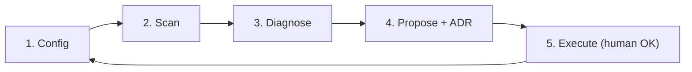
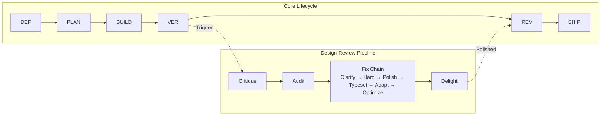

# Another Agent Skills

[](./LICENSE)
[](./RELEASE-NOTES.md)
[](skills/self-improvement/SKILL.md)
[](./CONTRIBUTING.md)
[](./PROGRESS_STATUS.md)
[](https://agentskills.io)

**58 composable skills + 6 harness components that turn AI coding agents into disciplined senior engineers.**
**No bloat. No shortcuts. Just process. Harness. Repeat.**
**+3 meta-skills to create, improve, and harvest your own.**

Define → Plan → Build → Verify → Review → Ship. Every time.

> Designed for [**OpenCode**](https://opencode.ai) first. Portable to Claude Code, Cursor, Kiro, and any agent via [`docs/AGENT-ADAPTERS.md`](./docs/AGENT-ADAPTERS.md).

---

## Quick Start

### Linux / macOS

```bash
git clone https://github.com/juandelossantos/another-agent-skills.git
cd another-agent-skills
bash install.sh          # Installs skills globally
init-agents              # In any project: activates skill-driven mode
```

### Windows (PowerShell)

```powershell
git clone https://github.com/juandelossantos/another-agent-skills.git
cd another-agent-skills
.\install.ps1            # Installs skills globally
init-agents              # In any project: activates skill-driven mode
```

**That's it.** Your AI agent now has 58 custom skills + 54 guides + 6 harness components.
The installer detects your shell (Zsh, Bash, Fish, PowerShell) and configures it automatically.

Run `init-agents` in every new project — it:
- Merges AGENTS.md without overwriting existing rules
- Links framework files (rules, scripts, SOUL.md) from global installation
- Detects your stack and creates `STACK_CONFIG.md`
- Installs lifecycle enforcement hook (tests, build, secrets)
- Installs CI pipeline (reads STACK_CONFIG.md)
- Creates `.sessionrc` for purpose-driven sessions

> **Safety:** Backs up before replacing. `init-agents` merges — never overwrites.
> **Universal:** Works with Node, Rust, Python, Go, Ruby, Dart, or any stack.
> **Agent adapters:** `bash install.sh --agent claude` or `.\install.ps1 -Agent claude`

---

## The Harness

> *"A raw model is not an agent. It becomes one once a harness gives it state, tool execution, feedback loops, and enforceable constraints."*
> — Osmani, Saboo & Kartakis, *The New SDLC With Vibe Coding*, 2026

**Agent = Model + Harness.** Most agent failures blamed on "the model" are actually configuration failures: missing tools, vague rules, absent guardrails, noisy context. This project is a complete open-source implementation of the Harness — the mechanical infrastructure that turns raw AI intelligence into reliable output.

> **🧠 New in v3.0.0: Universal Self-Improvement Loop** — The agent audits itself. `universal-audit.sh` detects issues in any project/stack, `self-improvement` skill diagnoses and proposes fixes, generates ADRs, and executes with human approval. [Learn more →](#whats-new-in-v300--universal-self-improvement-loop)

| Component | What It Is | In This Project |
|---|---|---|
| **1. Instructions & Rules** | Who the agent is, what it cares about, what it must never do | `AGENTS.md`, `SOUL.md`, `STEERING-GUIDE.md` |
| **2. Tools** | Task-specific capabilities loaded on demand | 58 skills in `skills/`, 54 guides, eval system |
| **3. Sandboxes & Execution** | Where the agent's code actually runs | Terminal, git workspace, CI |
| **4. Orchestration** | When each tool fires and how agents coordinate | `skill-gate.sh`, `init-agents.sh`, multi-agent skill |
| **5. Guardrails & Hooks** | Deterministic enforcement at lifecycle points | Pre-commit v8 (9 gates), commit-msg v6, commit-approval.sh |
| **6. Observability** | Evidence it's working or quietly drifting | `project-metrics`, `HEALTH-CHECK.md`, `PROGRESS_STATUS.md` |

[**Full Harness architecture →**](./docs/HARNESS.md)

---

## Commands

After installation, these commands are available in your terminal:

| Command | What It Does |
|---|---|
| `init-agents` | Activates skill-driven mode in any project. Merges rules, links framework files. |
| `update-global-skills` | Pulls latest skills from upstream (`addyosmani/agent-skills`). |
| `bash install.sh` | Full installer: 58 skills, shell config, global scripts. |
| `bash uninstall.sh` | Removes shell config, scripts, and installed skills. |

These are **project commands** you run in your terminal. They are NOT skills — skills are what the agent loads automatically when it detects a matching task.

---

## What Makes This Different

Most agent skill frameworks give you a library of prompts. This one gives you an engineering discipline — with mechanical enforcement, not just suggestions.

**Six Layers Beyond Prompts:**

1. **SOUL.md — Portable Agent Identity** — Who the agent is, what it believes, and what it never does. Travels across projects and sessions.
2. **The Harness** — 6-component architecture documented in [`docs/HARNESS.md`](./docs/HARNESS.md). Pre-commit v8 with 9 gates. Three-gate approval via commit-msg v6. No other framework does this.
3. **Guardian Pattern** — Before every mutation, the agent must present a DECISION POINT block and wait for explicit approval. Plan approval ≠ commit approval.
4. **Context Engineering** — Lazy loading: skills are ~250-line indexes; guides load on-demand. Result: **~3,870 tokens always-loaded** (1.9% of 200K) vs ~7,965 in eager mode.
5. **Stack-Agnostic Universal System** — `init-agents` detects your stack (Node, Rust, Python, Go, etc.) and creates `STACK_CONFIG.md` with your actual commands.
6. **Process Discipline** — User-gated commits with mandatory manifest. PR Review Gate. 25-entry anti-rationalization table. Debug 3-strikes escalation. Mayéutic Challenge.

### Context Budget

| System | Always-loaded | Lazy loading | Guides | Context control |
|---|---|---|---|---|
| Raw SKILL.md files | ~7,965 tokens | No | Inline | None |
| **Another Agent Skills** | **~3,870 tokens** | Yes, on-demand | 54 guides | Auto-evict at 70% |

---

## What's New in v3.0.0 — Universal Self-Improvement Loop

### ⭐ The Agent That Improves Any Project

v3.0.0 takes self-improvement to every project, every stack. The loop is now fully config-driven and stack-agnostic — no markdown-specific assumptions, no Node/Python lock-in, no per-project setup.



- **`universal-audit.sh`** — Config-driven detection engine. Reads `.audit-config.yaml` or `STACK_CONFIG.md` to discover project structure, select relevant checks, and skip irrelevant ones. Works with Node, Python, Rust, Go, Ruby, Dart, or any stack.
- **`self-improvement` skill (v3)** — Stack-agnostic. Detects CI health, doc drift, gate drift, coverage gaps, and anti-patterns regardless of language or framework.
- **4 comprehensive guides**: [`UNIVERSAL-USAGE.md`](skills/self-improvement/guides/UNIVERSAL-USAGE.md), [`CONFIG-REFERENCE.md`](skills/self-improvement/guides/CONFIG-REFERENCE.md), [`EXAMPLE-NODE.md`](skills/self-improvement/guides/EXAMPLE-NODE.md), [`EXAMPLE-PYTHON.md`](skills/self-improvement/guides/EXAMPLE-PYTHON.md)
- **`init-agents` includes loop by default** — Every new project starts with self-improvement wired in from day one
- **Behavioral golden test + domain-edge tests** — Validates loop behavior across language ecosystems, not just happy path

### Previous (v2.7.x)
- Self-Improvement Loop: markdown-focused audit and fix cycle

---

## Development Lifecycle



Every task starts at **Define** and moves through the pipeline. The Design Review Pipeline is triggered after Verify — it runs critique → audit → fix → delight before shipping. [**Full docs →**](./docs/lifecycle.html)

---

## Skills at a Glance

| Skill | When | What It Does |
|---|---|---|
| `engineering-fundamentals` | Foundation | Universal engineering philosophy: discovery, contracts, anti-slop, quality gates |
| `backend-api-mastery` | API/backend | REST/GraphQL, DB, auth, testing, docs |
| `spec-driven-development` | New features | Research-backed specs with critical thinking |
| `architecture-analysis` | Stack decisions | 2-3 options evaluated with trade-offs |
| `git-init-and-versioning` | Project setup | Git init, .gitignore, branching, pre-commit gates |
| `fullstack-shipping` | Deploy/go-live | CI/CD, monitoring, rollback, launch checklist |
| `project-health-check` | Existing code | Full codebase audit + drift detection |
| `dev-environment-audit` | Before build | MCPs, CLI tools, runtime verification |
| `user-onboarding` | First session | 30 preferences asked once, persisted forever |
| `project-metrics` | Background | Build pass rate, rework, coverage logging |
| `multi-agent-orchestration` | >2 agents | Parallel/pipeline/swarm patterns |
| `cli-tools` | Build a CLI | Arg parsing, exit codes, colors, progress bars |
| `doubt-driven-development` | High-stakes decisions | Fresh-context adversarial review |
| `shipping-and-launch` | Deploy | Pre-launch checklist, monitoring, rollback, TOOL_GAP |
| `context-engineering` | Session setup | Context hierarchy, packing, continuation-over-recap |

**Full catalog (58 skills) →** [`docs/skills.html`](./docs/skills.html) | [**Meta-Skills Guide →**](./docs/META-SKILLS-GUIDE.md) | [**Reference guide →**](docs/skills.html)

---

## Agent Compatibility

Another Agent Skills works with multiple AI coding agents. **Git hooks work everywhere.**

| Feature | OpenCode | Claude Code | Cursor | Kiro | Any Git Agent |
|---|---|---|---|---|---|
| Git hooks (pre-commit, commit-msg) | ✅ auto | ✅ auto | ✅ auto | ✅ auto | ✅ auto |
| Manifest gate (commit-approval.sh + log-test-results.sh) | ✅ auto | ✅ auto | ✅ auto | ✅ auto | ✅ auto |
| SOUL.md + AGENTS.md rules | ✅ auto | ⚠️ manual | ⚠️ manual | ⚠️ manual | ⚠️ manual |
| Skill concepts (TOOL_GAP, severity) | ✅ auto | ⚠️ manual | ⚠️ manual | ⚠️ manual | ⚠️ manual |
| i18n (EN/ES) | ✅ auto | ❌ N/A | ❌ N/A | ❌ N/A | ❌ N/A |

**Setup per agent →** [`docs/AGENT-ADAPTERS.md`](./docs/AGENT-ADAPTERS.md)

### Using Principles in Your Own System

| Principle | How to Use |
|---|---|
| **Harness** | Every agent feature needs a mechanical component, not just a prompt. If it can fail, it needs a gate. |
| **TOOL_GAP** | When verification tools can't reach the world, report "ship status unknown." Never fake success. |
| **Error Path Design** | Every tool call, gate, and loop needs a failure path designed at build time. |
| **Continuation Over Recap** | After context loss, resume from last known state. Don't re-explain everything. |
| **Drift Detection** | Check docs vs reality regularly. Stats, versions, features, commands, links. |
| **Manifest Gate** | Require a written summary of changes before any commit approval. |

---

## How to Use

### New Project

```bash
init-agents          # Creates AGENTS.md + .sessionrc with purpose
# Then start working. The agent loads the matching skill automatically.
```

### Existing Project

```bash
init-agents          # Merges skills into existing AGENTS.md or CLAUDE.md — never overwrites
```

### Pre-Flight Check

Before any edit in this repo:

```bash
bash scripts/pre-flight.sh
```

Checks: correct branch, clean working tree, remote up to date, upstream configured.
If it fails, ask the user before taking any action.

---

## Documentation Map

| File | What It Is |
|---|---|
| [`AGENTS.md`](./AGENTS.md) | Core rules: context persistence, intent mapping, lifecycle, mutation approval |
| [`AGENTS-EXTENDED.md`](./AGENTS-EXTENDED.md) | Full anti-rationalization table, Commit Manifest Protocol, project-type matrix |
| [`SOUL.md`](./SOUL.md) | Project identity: principles, values, what we never do |
| [`STEERING-GUIDE.md`](./STEERING-GUIDE.md) | Canonical files and severity — what the agent must always know |
| [`ANTI-PATTERNS.md`](./ANTI-PATTERNS.md) | Catalog of 11 agent workflow anti-patterns with code examples and mechanical fixes |
| [`GLOSSARY.md`](./GLOSSARY.md) | A-Z glossary of 40+ framework terms with source file cross-references |
| [`PATTERNS.md`](./PATTERNS.md) | Catalog of 8 workflow patterns with Mermaid diagrams and trade-off analysis |
| [`docs/HARNESS.md`](./docs/HARNESS.md) | Harness architecture: 6 components, Agent = Model + Harness |
| [`docs/DESIGN-WORKFLOW.md`](./docs/DESIGN-WORKFLOW.md) | Design ecosystem map: skills, lifecycle, decision tree, review pipeline |
| [`docs/AGENT-ADAPTERS.md`](./docs/AGENT-ADAPTERS.md) | Agent compatibility, adapter setup, per-agent configuration |
| [`PROGRESS_STATUS.md`](./PROGRESS_STATUS.md) | Project state, roadmap, and phased completion |
| [`RELEASE-NOTES.md`](./RELEASE-NOTES.md) | Changelog and version history (current: v3.0.0) |
| [`HEALTH-CHECK.md`](./HEALTH-CHECK.md) | Project health audit (58 skills, auto-generated, validated against linter) |
| [`DEVELOPMENT.md`](./DEVELOPMENT.md) | Maintainer conventions and artifact rules |
| [`STACK_CONFIG_TEMPLATE.md`](./STACK_CONFIG_TEMPLATE.md) | Stack-agnostic configuration template |
| [ADRs/](./ADRs/) | Architecture Decision Records |
| [`scripts/git-hooks/pre-commit`](./scripts/git-hooks/pre-commit) | Pre-commit hook v8 (9 gates) |
| [`scripts/git-hooks/commit-msg`](./scripts/git-hooks/commit-msg) | Commit-msg hook v6 (three-gate approval: TEST_LOG + MANIFEST + APPROVED) |
| [`scripts/commit-approval.sh`](./scripts/commit-approval.sh) | Commit approval with time-window manifest gate |
| [`install.sh`](./install.sh) | Cross-shell installer (Linux/macOS) |
| [`install.ps1`](./install.ps1) | PowerShell installer (Windows) |

**Full documentation site →** [`docs/index.html`](./docs/index.html)

---

## Contributing

Pull requests are welcome. Whether it's a new skill, a guide improvement, or a bug fix — the bar is quality, not complexity.

1. Fork the repo.
2. Add or improve a skill in `skills/`.
3. Follow lazy loading: SKILL.md as index, `*-GUIDE.md` for details.
4. Keep it tight: no filler, no duplication, imperative voice.
5. Test with `bash install.sh`.
6. Open a PR.

**Guides and conventions:** [`DEVELOPMENT.md`](./DEVELOPMENT.md) covers the artifact convention (`development/` is git-ignored), skill templates, and review process.

**Blocked on something?** [Open an issue](https://github.com/juandelossantos/another-agent-skills/issues) — I prioritize by demand.

---

## Uninstall

```bash
# Linux / macOS — removes shell config, scripts, skills, remote repo
bash uninstall.sh

# Windows
.\uninstall.ps1
```

Does not remove your user profile (`~/.config/opencode/user-profile.json`) or this repository.

## Requirements

- **Git** + **Bash** (Linux/macOS) or **PowerShell** (Windows)
- **OpenCode** recommended. Adapters available for Claude Code, Cursor, and Kiro.

---

## Prior Art & Credits

Ideas borrowed from the ecosystem, adapted to fit our philosophy. We don't copy. We synthesize.

| Source | What We Took | How We Adapted |
|---|---|---|
| [Singhal et al. — *Agent Skills* (Google, 2026)](https://drive.google.com/file/d/1Wso-CM4aAvTxFZa5wjBntKM3IVSg7PWW/view) | EDD (Evaluation-Driven Development), 4 failure modes, Read/Draft/Act tiers, eval toolkit (5 patterns), meta-skills, skill smells | Created v2.0.0 eval framework (`scripts/eval/`), skill tier system in frontmatter, smells detection in skill-lint.sh, 14 new skills completing the lifecycle pipeline |
| [Addy Osmani](https://github.com/addyosmani/agent-skills) | 23 upstream skills as foundation | Expanded to 55 skills with lazy loading, guides, enforcement, and evaluation system |
| [Osmani, Saboo & Kartakis — *The New SDLC With Vibe Coding*](https://drive.google.com/file/d/1wNEl8FMpTso8aXlb_joxgzparxi-0ciM/view) (2026) | Harness engineering, factory model, agentic engineering spectrum | Created `docs/HARNESS.md`, reframed enforcement as "The Harness", added AI review checklist, expanded Memory system |
| [github/spec-kit](https://github.com/github/spec-kit) (2026) | Structured clarification before planning, convergence checks, research artifacts, parallel task markers | Added P2 Clarification + P10 Convergence to `spec-driven-development`, `architecture/research.md` artifact, `[S]/[P]/[Pm]` markers to `planning-and-task-breakdown` |
| [Affaan Mustafa / ECC](https://github.com/affaan-m/ECC) | Cross-platform enforcement, SOUL.md pattern, shared memory gap analysis | Created SOUL.md, mechanical enforcement, incident-driven evolution |
| [Sub-Zero Skill](https://github.com/henchmarketing-rgb/sub-zero-skill) | TOOL_GAP verdict, fresh-context verification, drift detection | Added to SOUL.md principle 8, Rule 0h, code-review-and-quality, project-health-check, shipping-and-launch |
| [awesome-skills/code-review-skill](https://github.com/awesome-skills/code-review-skill) | 6-level severity labels | Added to code-review-and-quality skill |
| [Harness Books](https://github.com/wquguru/harness-books) | Error path design, continuation-over-recap, 10 principles of harness engineering | Added to engineering-fundamentals, Rule 0i, SOUL.md |
| [Leonxlnx / taste-skill](https://github.com/Leonxlnx/taste-skill) | Design taste and anti-slop frontend | Integrated into critique-skill and design review pipeline |
| [Paul Bakaus / impeccable.style](https://impeccable.style) | Design review pipeline inspiration | Built 9-skill pipeline: critique → audit → fix → delight |
| [Julius Brussee / caveman](https://github.com/JuliusBrussee/caveman) | Token optimization inspiration | Lazy loading, 250-line skill indexes, 60/25/15 context budget |
| [OpenCode team](https://opencode.ai) | Native skill framework and invocation system | Built as OpenCode-first, portable to other agents |

---

## License

MIT © 2026 juandelossantos
