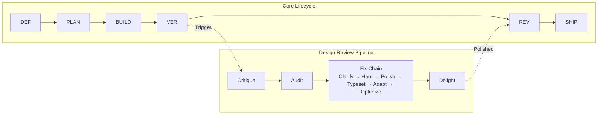

# Another Agent Skills

[](./LICENSE)
[](./RELEASE-NOTES.md)
[](./CONTRIBUTING.md)
[](./PROGRESS_STATUS.md)

**38 composable skills + mechanical enforcement that turn AI coding agents into disciplined senior engineers.**
**No bloat. No shortcuts. Just process.**

Define → Plan → Build → Verify → Review → Ship. Every time.

> Designed for [**OpenCode**](https://opencode.ai) first. Portable to Claude Code, Cursor, Kiro, and any agent via [`docs/AGENT-ADAPTERS.md`](./docs/AGENT-ADAPTERS.md).

---

## Quick Start

### Linux / macOS

```bash
git clone https://github.com/juandelossantos/another-agent-skills.git
cd another-agent-skills
bash install.sh          # Installs skills globally
init-agents              # In any project: activates skill-driven mode
```

### Windows (PowerShell)

```powershell
git clone https://github.com/juandelossantos/another-agent-skills.git
cd another-agent-skills
.\install.ps1            # Installs skills globally
init-agents              # In any project: activates skill-driven mode
```

**That's it.** Your AI agent now has 38 custom skills + 45 guides.
The installer detects your shell (Zsh, Bash, Fish, PowerShell) and configures it automatically.

Run `init-agents` in every new project — it:
- Merges AGENTS.md without overwriting existing rules
- Detects your stack and creates `STACK_CONFIG.md`
- Installs lifecycle enforcement hook (tests, build, secrets)
- Installs CI pipeline (reads STACK_CONFIG.md)
- Creates `.sessionrc` for purpose-driven sessions

> **Safety:** Backs up before replacing. `init-agents` merges — never overwrites.
> **Universal:** Works with Node, Rust, Python, Go, Ruby, Dart, or any stack.
> **Agent adapters:** `bash install.sh --agent claude` or `.\install.ps1 -Agent claude`

---

## Commands

After installation, these commands are available in your terminal:

| Command | What It Does |
|---|---|
| `init-agents` | Activates skill-driven mode in any project. Merges rules without overwriting. |
| `update-global-skills` | Pulls latest skills from upstream (`addyosmani/agent-skills`). |
| `bash install.sh` | Full installer: 54 skills, shell config, global scripts. |
| `bash uninstall.sh` | Removes shell config, scripts, and installed skills. |

These are **project commands** you run in your terminal. They are NOT skills — skills are what the agent loads automatically when it detects a matching task.

---

## What Makes This Different

Most agent skill frameworks give you a library of prompts. This one gives you an engineering discipline — with mechanical enforcement, not just suggestions.

### Six Layers Beyond Prompts

**1. SOUL.md — Portable Agent Identity** — A single document that defines who the agent is, what it believes, and what it never does. Travels across projects and sessions. Not just rules — a philosophy.

**2. Mechanical Enforcement** — Pre-commit v6 with 10 gates: branch check, staged changes, remote sync, HTML integrity, SHA256 hash verification, build verification, anti-slop detection (10 patterns), debug 3-strikes tracking, SPEC enforcement, skill-lint. No other framework does this.

**3. Guardian Pattern** — Before any mutation (commit, push, merge, rebase), the agent must present a DECISION POINT block, explain rationale, and wait for explicit approval. Invalid responses like "ok" and "continue" are rejected. Plan approval ≠ commit approval — always separate decisions.

**4. Context Engineering** — Lazy loading: skills are ~250-line indexes; detailed guides load only on-demand. Result: ~3,675 tokens always-loaded (1.8% of 200K) vs ~7,965 in eager mode (54% savings). Auto-eviction at 70% context usage.

**5. Stack-Agnostic Universal System** — `init-agents` detects your stack (Node, Rust, Python, Go, Ruby, Dart, or unknown) and creates `STACK_CONFIG.md` with your actual commands. CI, hooks, and skills all read from this file. Works for any project, not just specific frameworks.

**6. Process Discipline** — User-gated commits (approve-commit.sh). PR Review Gate. 25-entry anti-rationalization table. Debug 3-strikes escalation. Mayéutic Challenge (agents that push back). Incident-driven enforcement evolution.

### Context Budget

| System | Always-loaded | Lazy loading | Guides | Context control |
|--------|--------------|--------------|--------|-----------------|
| Raw SKILL.md files | ~7,965 tokens | No | Inline | None |
| **Another Agent Skills** | **~3,675 tokens** | Yes, on-demand | Yes, 45 guides | Auto-evict at 70% |

---

## What's New in v1.6.0

- **FAQ section** — 6 frequently asked questions with clear answers
- **Quick Start section** — 3-step installation guide on landing page
- **Skills grid** — Visual showcase of all 38 skills
- **Compatible agents section** — OpenCode, Claude Code, Cursor, Kiro support
- **Philosophy section** — SOUL.md principles explained
- **Enforcement section** — 3 levels of mechanical enforcement
- **How it works section** — 6-phase lifecycle visual
- **skill-gate.sh** — Mechanical Rule 1 enforcement script
- **approve-commit.sh --auto** — Approval in chat, token auto-generated
- **Rule 12 formalization** — "yes commit" and "yes push" as approval keywords

> "Ship an API" → loads `backend-api-mastery` → protocol decision → DB schema → endpoints → tests.
> "Fix a bug" → loads `debugging-and-error-recovery` → repro test → root cause → fix → verify.
> "Review a PR" → runs `pr-review-checklist.sh` → verifies 8 mechanical gates → merge.
> Every task has a defined process, every mutation has a decision point. No guessing.

---

## Development Lifecycle



Every task starts at **Define** and moves through the pipeline. The **Design Review Pipeline** is triggered after Verify — it runs critique → audit → fix → delight before shipping.

## Skills at a Glance

| Skill | When | What It Does |
|---|---|---|
| `engineering-fundamentals` | Foundation | Universal engineering philosophy: discovery protocols, contract-first design, anti-slop detection (25 patterns), quality gates, Three Dials design core, pre-flight enforcement, context eviction. Implicitly loaded by every skill. |
| `backend-api-mastery` | API/backend | REST/GraphQL, DB, auth, testing, docs |
| `spec-driven-development` | New features | Research-backed specs with critical thinking |
| `architecture-analysis` | Stack decisions | 2-3 options evaluated with trade-offs |
| `git-init-and-versioning` | Project setup | Git init, .gitignore, branching, pre-commit gates |
| `fullstack-shipping` | Deploy/go-live | CI/CD, monitoring, rollback, launch checklist |
| `project-health-check` | Existing code | Full codebase audit before new work |
| `dev-environment-audit` | Before build | MCPs, CLI tools, runtime verification |
| `user-onboarding` | First session | 30 preferences asked once, persisted forever |
| `project-metrics` | Background | Build pass rate, rework, coverage logging |
| `multi-agent-orchestration` | >2 agents | Parallel/pipeline/swarm patterns with `task` tool |
| `cli-tools` | Build a CLI | arg parsing, exit codes, colors, progress bars |

**Design platform skills →** See [`docs/DESIGN-SKILLS.md`](./docs/DESIGN-SKILLS.md) for the full design ecosystem: 21 platform and review skills including frontend-web, frontend-mobile, industrial-brutalist-ui, the 9-skill design review pipeline (critique → audit → fix → delight), and more.

## Design Review Pipeline

The pipeline turns subjective design feedback into a deterministic, measurable process. Each skill handles one dimension, and together they cover the full quality spectrum.

| Skill | Dimension | Strength | Typical Score |
|---|---|---|---|
| `critique-skill` | Design quality | Heuristic review (Nielsen 10, 4 personas), AI slop detection, LLM + automated passes | 0-4 per heuristic |
| `audit-skill` | Technical quality | 5-dimension scan: a11y, perf, theming, responsive, anti-patterns. P0-P3 severity | 0-4 per dimension |
| `clarify-skill` | UX copy | Rewrites labels, errors, buttons, empty states, confirmations. Voice-tuned per audience | 8 QA gates |
| `hard-skill` | Accessibility & robustness | Mechanical P0/P1 fixes: ARIA, keyboard nav, validation, error/empty/loading states | Traces to audit |
| `polish-skill` | Design details | Fixes spacing, alignment, token drift, border radius, shadows. No design decisions | Token compliance |
| `typeset-skill` | Typography | Applies type ramp, fixes line-height, letter-spacing, paragraph rhythm | 8 QA gates |
| `adapt-skill` | Responsive layout | Breakpoints, touch targets (≥44px), viewport, mobile overflow | 9 QA gates |
| `optimize-skill` | Performance | Bundle size, lazy loading, image optimization, animation compositing, layout thrashing | Lighthouse ≥90 |
| `delight-skill` | Micro-interactions | Hover/tap feedback, state transitions, loading animation, success/error feedback | 9 QA gates |

**Typical flow:** critique highlights design gaps → audit finds technical issues → clarify/hard/polish/typeset/adapt/optimize fix them → delight adds the polish. All skills are cross-platform and stack-agnostic.

---

## How to Use

### New Project

```bash
init-agents          # Creates AGENTS.md + .sessionrc with purpose
# Then start working. The agent loads the matching skill automatically.
```

### Existing Project

```bash
init-agents          # Merges skills into existing AGENTS.md or CLAUDE.md — never overwrites
```

### Pre-Flight Check

Before any edit in this repo:

```bash
bash scripts/pre-flight.sh
```

Checks: correct branch, clean working tree, remote up to date, upstream configured.
If it fails, ask the user before taking any action.

---

### Other AI Agents (Claude Code, Cursor, Kiro)

```bash
# Linux / macOS
bash install.sh --agent claude    # CLAUDE.md + .claude-plugin/
bash install.sh --agent cursor    # .cursorrules + .cursor-plugin/
bash install.sh --agent kiro     # .kiro/hooks/
bash install.sh --agent all      # All adapters
```

```powershell
# Windows
.\install.ps1 -Agent claude
.\install.ps1 -Agent cursor
.\install.ps1 -Agent kiro
.\install.ps1 -Agent all
```

**Hook support:** Each agent has native plugin/hook configs with automatic enforcement:
- Claude Code: `.claude-plugin/agent-discipline/`
- Cursor: `.cursor-plugin/agent-discipline/`
- Kiro: `.kiro/hooks/agent-discipline.json`

See [`docs/AGENT-ADAPTERS.md`](./docs/AGENT-ADAPTERS.md) for full instructions.

---

## Documentation Map

| File | What It Is |
|---|---|
| [`AGENTS.md`](./AGENTS.md) | Core rules: context persistence, intent mapping, lifecycle, mutation approval |
| [`AGENTS-EXTENDED.md`](./AGENTS-EXTENDED.md) | Full anti-rationalization table, Commit Manifest Protocol, project-type matrix |
| [`EXAMPLES.md`](./EXAMPLES.md) | Before/after skill usage demonstrations |
| [`docs/DESIGN-WORKFLOW.md`](./docs/DESIGN-WORKFLOW.md) | Design ecosystem map: skills, lifecycle, decision tree, review pipeline |
| [`docs/DESIGN-SKILLS.md`](./docs/DESIGN-SKILLS.md) | All design-related skills: platforms, skins, review pipeline |
| [`docs/EXAMPLES.md`](./docs/EXAMPLES.md) | Full 366-line before/after reference |
| [`PROGRESS_STATUS.md`](./PROGRESS_STATUS.md) | Project state, roadmap, and phased completion |
| [`RELEASE-NOTES.md`](./RELEASE-NOTES.md) | Changelog and version history (current: v1.4.0) |
| [`HEALTH-CHECK.md`](./HEALTH-CHECK.md) | Project health audit (23/24 passes, 0 criticals) |
| [`DEVELOPMENT.md`](./DEVELOPMENT.md) | Maintainer conventions and artifact rules |
| [`STACK_CONFIG_TEMPLATE.md`](./STACK_CONFIG_TEMPLATE.md) | Stack-agnostic configuration template |
| [ADRs/](./ADRs/) | Architecture Decision Records |
| [`scripts/pre-flight.sh`](./scripts/pre-flight.sh) | Pre-action git state check + pre-commit hook v6 enforcement (9 gates) |
| [`install.sh`](./install.sh) | Cross-shell installer (Linux/macOS) |
| [`install.ps1`](./install.ps1) | PowerShell installer (Windows) |
| [`uninstall.sh`](./uninstall.sh) | Clean uninstaller (Linux/macOS) |
| [`uninstall.ps1`](./uninstall.ps1) | Clean uninstaller (Windows) |
| `skills/<name>/SKILL.md` | Individual skill index (all ≤ 250 lines) |
| `skills/<name>/*-GUIDE.md` | Phase-specific guides (loaded on-demand) |

**Every skill follows the same pattern:** SKILL.md as index + guides per phase. Lazy loading keeps initial context under 600 lines.

**Design skills catalog:** See [`docs/DESIGN-SKILLS.md`](./docs/DESIGN-SKILLS.md) for the full design ecosystem — platform skills, direction skins, and the review pipeline with detailed descriptions.
**Design workflow:** See [`docs/DESIGN-WORKFLOW.md`](./docs/DESIGN-WORKFLOW.md) for the lifecycle map — how skills chain together, which are universal vs platform-specific, and what to use in each scenario.

---

## Contributing

Pull requests are welcome. Whether it's a new skill, a guide improvement, or a bug fix — the bar is quality, not complexity.

**Quick start for contributors:**

1. Fork the repo.
2. Add or improve a skill in `skills/`.
3. Follow lazy loading: SKILL.md as index, `*-GUIDE.md` for details.
4. Keep it tight: no filler, no duplication, imperative voice.
5. Test with `bash install.sh`.
6. Open a PR.

**Guides and conventions:** [`DEVELOPMENT.md`](./DEVELOPMENT.md) covers the artifact convention (`development/` is git-ignored), skill templates, and review process.

**Blocked on something?** [Open an issue](https://github.com/juandelossantos/another-agent-skills/issues) — I prioritize by demand.

---

## Uninstall

```bash
# Linux / macOS — removes shell config, scripts, skills, remote repo
bash uninstall.sh

# Windows
.\uninstall.ps1
```

Does not remove your user profile (`~/.config/opencode/user-profile.json`) or this repository.

## Requirements

- **Git** + **Bash** (Linux/macOS) or **PowerShell** (Windows)
- **OpenCode** recommended. Adapters available for Claude Code and Cursor.

---

## Credits

Built on the shoulders of:
- **Addy Osmani** — [`agent-skills`](https://github.com/addyosmani/agent-skills) (23 upstream skills)
- **Affaan Mustafa** — [`ECC`](https://github.com/affaan-m/ECC) (inspiration for cross-platform enforcement, shared memory gap analysis, and SOUL.md pattern)
- **Leonxlnx** — [`taste-skill`](https://github.com/Leonxlnx/taste-skill) — design taste and anti-slop frontend
- **Paul Bakaus** — [`impeccable.style`](https://impeccable.style) — design review pipeline inspiration (critique → audit → fix → delight)
- **tw93** — [`open-design`](https://github.com/nexu-io/open-design) — stack-agnostic design system approach
- **Julius Brussee** — [`caveman`](https://github.com/JuliusBrussee/caveman) — token optimization inspiration
- **Andrej Karpathy** — Behavioral observations on LLM coding failures
- **OpenCode team** — Native skill framework and invocation system

---

## License

MIT © 2026
