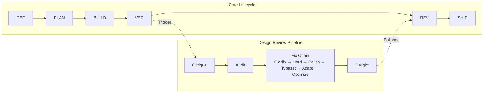

# Another Agent Skills

[](./LICENSE)
[](./RELEASE-NOTES.md)
[](skills/self-improvement/SKILL.md)
[](./CONTRIBUTING.md)
[](./PROGRESS_STATUS.md)
[](https://agentskills.io)

**57 composable skills + 6 harness components that turn AI coding agents into disciplined senior engineers.**
**No bloat. No shortcuts. Just process. Harness. Repeat.**
**+3 meta-skills to create, improve, and harvest your own.**

Define → Plan → Build → Verify → Review → Ship. Every time.

> Designed for [**OpenCode**](https://opencode.ai) first. Portable to Claude Code, Cursor, Kiro, and any agent via [`docs/AGENT-ADAPTERS.md`](./docs/AGENT-ADAPTERS.md).

---

## Quick Start

### Linux / macOS

```bash
git clone https://github.com/juandelossantos/another-agent-skills.git
cd another-agent-skills
bash install.sh          # Installs skills globally
init-agents              # In any project: activates skill-driven mode
```

### Windows (PowerShell)

```powershell
git clone https://github.com/juandelossantos/another-agent-skills.git
cd another-agent-skills
.\install.ps1            # Installs skills globally
init-agents              # In any project: activates skill-driven mode
```

**That's it.** Your AI agent now has 57 custom skills + 74 guides + 6 harness components.
The installer detects your shell (Zsh, Bash, Fish, PowerShell) and configures it automatically.

Run `init-agents` in every new project — it:
- Merges AGENTS.md without overwriting existing rules
- Links framework files (rules, scripts, SOUL.md) from global installation
- Detects your stack and creates `STACK_CONFIG.md`
- Installs lifecycle enforcement hook (tests, build, secrets)
- Installs CI pipeline (reads STACK_CONFIG.md)
- Creates `.sessionrc` for purpose-driven sessions

> **Safety:** Backs up before replacing. `init-agents` merges — never overwrites.
> **Universal:** Works with Node, Rust, Python, Go, Ruby, Dart, or any stack.
> **Agent adapters:** `bash install.sh --agent claude` or `.\install.ps1 -Agent claude`
>
> **📖 New to skills?** Read the [**Quick Start Guide →**](./docs/quickstart-guide.html) ([Markdown version](./QUICKSTART.md)) for a step-by-step walkthrough of your first session, how skills activate, and day-to-day tips.

---

## The Harness

> *"A raw model is not an agent. It becomes one once a harness gives it state, tool execution, feedback loops, and enforceable constraints."*
> — Osmani, Saboo & Kartakis, *The New SDLC With Vibe Coding*, 2026

**Agent = Model + Harness.** Most agent failures blamed on "the model" are actually configuration failures: missing tools, vague rules, absent guardrails, noisy context. This project is a complete open-source implementation of the Harness — the mechanical infrastructure that turns raw AI intelligence into reliable output.

> **🧠 Latest: v4.2.0 — Phase 3: Output Contracts Complete** — All 57 skills now have standardized Output Contracts. 0 lint warnings. [Learn more →](#whats-new-in-v420--phase-3-output-contracts-complete)

| Component | What It Is | In This Project |
|---|---|---|
| **1. Instructions & Rules** | Who the agent is, what it cares about, what it must never do | `AGENTS.md`, `SOUL.md`, `STEERING-GUIDE.md` |
| **2. Tools** | Task-specific capabilities loaded on demand | 57 skills in `skills/`, 74 guides, eval system |
| **3. Sandboxes & Execution** | Where the agent's code actually runs | Terminal, git workspace, CI |
| **4. Orchestration** | When each tool fires and how agents coordinate | `skill-gate.sh`, `init-agents.sh`, multi-agent skill |
| **5. Guardrails & Hooks** | Deterministic enforcement at lifecycle points | Pre-commit v11 (14 gates, Test Runner), commit-msg v4 (TDD gate), commit-approval.sh |
| **6. Observability** | Evidence it's working or quietly drifting | `project-metrics`, `HEALTH-CHECK.md`, `PROGRESS_STATUS.md` |

[**Full Harness architecture →**](./docs/HARNESS.md)

---

## Commands

After installation, these commands are available in your terminal:

| Command | What It Does |
|---|---|
| `init-agents` | Activates skill-driven mode in any project. Merges rules, links framework files. |
| `update-global-skills` | Pulls latest skills from upstream (`addyosmani/agent-skills`). |
| `bash install.sh` | Full installer: 57 skills, shell config, global scripts. |
| `bash uninstall.sh` | Removes shell config, scripts, and installed skills. |

These are **project commands** you run in your terminal. They are NOT skills — skills are what the agent loads automatically when it detects a matching task.

---

## What Makes This Different

Most agent skill frameworks give you a library of prompts. This one gives you an engineering discipline — with mechanical enforcement, not just suggestions.

**Six Layers Beyond Prompts:**

1. **SOUL.md — Portable Agent Identity** — Who the agent is, what it believes, and what it never does. Travels across projects and sessions.
2. **The Harness** — 6-component architecture documented in [`docs/HARNESS.md`](./docs/HARNESS.md). Pre-commit v11 with 14 gates (including Test Runner). Single-gate TDD enforcement via commit-msg v4. No other framework does this.
3. **Guardian Pattern** — Before every mutation, the agent must present a DECISION POINT block and wait for explicit approval. Plan approval ≠ commit approval.
4. **Context Engineering** — Lazy loading: skills are ~250-line indexes; guides load on-demand. Result: **~3,870 tokens always-loaded** (1.9% of 200K) vs ~7,965 in eager mode.
5. **Stack-Agnostic Universal System** — `init-agents` detects your stack (Node, Rust, Python, Go, etc.) and creates `STACK_CONFIG.md` with your actual commands.
6. **Process Discipline** — User-gated commits with mandatory manifest. PR Review Gate. 25-entry anti-rationalization table. Debug 3-strikes escalation. Mayéutic Challenge.

### Context Budget

| System | Always-loaded | Lazy loading | Guides | Context control |
|---|---|---|---|---|
| Raw SKILL.md files | ~7,965 tokens | No | Inline | None |
| **Another Agent Skills** | **~3,870 tokens** | Yes, on-demand | 74 guides | Auto-evict at 70% |

---

## What's New in v4.2.0 — Phase 3: Output Contracts Complete

All 57 skills now have standardized **Output Contracts** — each declares its artifact, format, location, and quality criteria. No more guessing what a skill produces. Check 16 warnings eliminated (37→0). Word count advisories resolved (4→0). Pre-flight gate added enforcing `.gitignore` and `.env.example` before edits.

## What's New in v4.1.0 — Quick Start Guide & Navigation Overhaul

### 📖 Quick Start Guide, Full Spanish i18n, Nav Chain Fixes

v4.1.0 adds a user-facing Quick Start Guide for daily workflow, full Spanish translation of all nav elements, and a comprehensive navigation chain fix across all 13 docs pages.

- **Quick Start Guide** ([`docs/quickstart-guide.html`](./docs/quickstart-guide.html), [`QUICKSTART.md`](./QUICKSTART.md)) — Step-by-step walkthrough of your first session, how skills activate, the 6 phases from your side, Guardian Pattern, common scenarios, and pro tips.
- **Full Spanish i18n** — 60 keys translated for Quick Start Guide content. All 24 nav prev/next buttons translated in both EN/ES.
- **Navigation chain** — All 13 docs pages fixed with correct prev/next buttons following sidebar order.
- **COMMIT_APPROVED gate restored** — commit-approval.sh requires explicit "yes commit" in chat. commit-msg v4 validates TDD only.
- **TDD gate expanded** — HTML, JSON, Markdown, YAML, CSS, and more now require tests. SKIP_PATTERNS for binaries and lock files.

> See the [full release history](https://github.com/juandelossantos/another-agent-skills/releases) for all versions.

### Previous Releases

<details>
<summary>v3.1.1 — Test Infrastructure & TDD Enhancement</summary>

- **`tests/run-all.sh`** — Unified test runner: runs 9 suites (audit, init, TDD gate, pre-commit gates, Gate 14 behavioral, sync hooks, skill lint, eval e2e).
- **`scripts/git-hooks/pre-commit` v11** — 14 sequential gates. Gate 14 (Test Runner) runs `bash tests/run-all.sh` before every commit.
- **`scripts/tdd-gate.sh`** — Enhanced with name-pairing check and new-test enforcement.
- **46 total project tests** across 6 suites.

</details>

<details>
<summary>v3.1.0 — TDD Enforcement Gate</summary>

- **`scripts/tdd-gate.sh`** — Standalone TDD enforcement gate. Blocks commits without test files.
- **`scripts/git-hooks/commit-msg` v4** — Single TDD gate with OVERRIDE mechanism.
- **`scripts/init-agents.sh sync-hooks`** — New subcommand for upgrading hooks.

</details>

---

## Testing

Run all test suites with a single command:

```bash
bash tests/run-all.sh
```

The test runner executes 9 suites and reports pass/fail per suite:

| Suite | Command | What It Tests |
|---|---|---|
| Audit wrapper-contract | `bash tests/audit/run.sh` | Audit engine behavioral invariants |
| Audit universal engine | `bash tests/audit/universal.sh` | Config-driven audit engine (17 feature tests) |
| Init-agents features | `bash tests/init/run.sh` | init-agents scaffolding (7 tests) |
| TDD gate | `bash tests/test-tdd-gate.sh` | TDD enforcement: name-pairing + new-test (14 tests) |
| Pre-commit gates | `bash tests/test-pre-commit-gates.sh` | Gate numbering sequential 1-14 (7 tests) |
| Gate 14 behavioral | `bash tests/test-pre-commit-gate-14.sh` | Test Runner blocks on failure, passes on success (7 tests) |
| Sync hooks | `bash tests/test-sync-hooks.sh` | Hook installation and sync (7 tests) |
| Skill lint | `bash scripts/skill-lint.sh skills/` | Rule 6: SKILL.md ≤250 lines, guides present |
| Eval e2e | `bash scripts/eval/test-e2e.sh` | End-to-end: skill-lint + evals + dashboard + regression |

The test runner also runs automatically as **Pre-commit Gate 14** before every commit.

### TDD Gate Rules

Every commit with code changes must include a matching test file:

- **Name-pairing**: test file name must match code file name (e.g., `scripts/tdd-gate.sh` → `tests/test-tdd-gate.sh`)
- **New-test**: at least one staged test file must be new (not previously committed)
- **Override**: add `OVERRIDE: reason` to commit message body to bypass

### Playwright Tests (Browser)

Browser tests live in `tests/playwright/`:

```bash
cd tests/playwright
npm install
npx playwright install chromium
# Run tests: npx playwright test
```

Requires the Chrome DevTools MCP server configured in your agent's `.mcp.json`.

---

## Development Lifecycle



Every task starts at **Define** and moves through the pipeline. The Design Review Pipeline is triggered after Verify — it runs critique → audit → fix → delight before shipping. [**Full docs →**](./docs/lifecycle.html)

---

## Skills at a Glance

| Skill | When | What It Does |
|---|---|---|
| `engineering-fundamentals` | Foundation | Universal engineering philosophy: discovery, contracts, anti-slop, quality gates |
| `backend-api-mastery` | API/backend | REST/GraphQL, DB, auth, testing, docs |
| `spec-driven-development` | New features | Research-backed specs with critical thinking |
| `architecture-analysis` | Stack decisions | 2-3 options evaluated with trade-offs |
| `git-init-and-versioning` | Project setup | Git init, .gitignore, branching, pre-commit gates |
| `fullstack-shipping` | Deploy/go-live | CI/CD, monitoring, rollback, launch checklist |
| `project-health-check` | Existing code | Full codebase audit + drift detection |
| `dev-environment-audit` | Before build | MCPs, CLI tools, runtime verification |
| `user-onboarding` | First session | 30 preferences asked once, persisted forever |
| `project-metrics` | Background | Build pass rate, rework, coverage logging |
| `multi-agent-orchestration` | >2 agents | Parallel/pipeline/swarm patterns |
| `cli-tools` | Build a CLI | Arg parsing, exit codes, colors, progress bars |
| `doubt-driven-development` | High-stakes decisions | Fresh-context adversarial review |
| `shipping-and-launch` | Deploy | Pre-launch checklist, monitoring, rollback, TOOL_GAP |
| `context-engineering` | Session setup | Context hierarchy, packing, continuation-over-recap |

**Full catalog (57 skills) →** [`docs/skills.html`](./docs/skills.html) | [**Meta-Skills Guide →**](./docs/META-SKILLS-GUIDE.md) | [**Reference guide →**](docs/skills.html)

---

## Agent Compatibility

Another Agent Skills works with multiple AI coding agents. **Git hooks work everywhere.**

| Feature | OpenCode | Claude Code | Cursor | Kiro | Any Git Agent |
|---|---|---|---|---|---|
| Git hooks (pre-commit, commit-msg) | ✅ auto | ✅ auto | ✅ auto | ✅ auto | ✅ auto |
| Manifest gate (commit-approval.sh + log-test-results.sh) | ✅ auto | ✅ auto | ✅ auto | ✅ auto | ✅ auto |
| SOUL.md + AGENTS.md rules | ✅ auto | ⚠️ manual | ⚠️ manual | ⚠️ manual | ⚠️ manual |
| Skill concepts (TOOL_GAP, severity) | ✅ auto | ⚠️ manual | ⚠️ manual | ⚠️ manual | ⚠️ manual |
| i18n (EN/ES) | ✅ auto | ❌ N/A | ❌ N/A | ❌ N/A | ❌ N/A |

**Setup per agent →** [`docs/AGENT-ADAPTERS.md`](./docs/AGENT-ADAPTERS.md)

### Using Principles in Your Own System

| Principle | How to Use |
|---|---|
| **Harness** | Every agent feature needs a mechanical component, not just a prompt. If it can fail, it needs a gate. |
| **TOOL_GAP** | When verification tools can't reach the world, report "ship status unknown." Never fake success. |
| **Error Path Design** | Every tool call, gate, and loop needs a failure path designed at build time. |
| **Continuation Over Recap** | After context loss, resume from last known state. Don't re-explain everything. |
| **Drift Detection** | Check docs vs reality regularly. Stats, versions, features, commands, links. |
| **Manifest Gate** | Require a written summary of changes before any commit approval. |

---

## How to Use

### New Project

```bash
init-agents          # Creates AGENTS.md + .sessionrc with purpose
# Then start working. The agent loads the matching skill automatically.
```

### Existing Project

```bash
init-agents          # Merges skills into existing AGENTS.md or CLAUDE.md — never overwrites
```

### Pre-Flight Check

Before any edit in this repo:

```bash
bash scripts/pre-flight.sh
```

Checks: correct branch, clean working tree, remote up to date, upstream configured.
If it fails, ask the user before taking any action.

---

## Documentation Map

| File | What It Is |
|---|---|
| [`AGENTS.md`](./AGENTS.md) | Core rules: context persistence, intent mapping, lifecycle, mutation approval |
| [`AGENTS-EXTENDED.md`](./AGENTS-EXTENDED.md) | Full anti-rationalization table, Commit Manifest Protocol, project-type matrix |
| [`SOUL.md`](./SOUL.md) | Project identity: principles, values, what we never do |
| [`STEERING-GUIDE.md`](./STEERING-GUIDE.md) | Canonical files and severity — what the agent must always know |
| [`ANTI-PATTERNS.md`](./ANTI-PATTERNS.md) | Catalog of 11 agent workflow anti-patterns with code examples and mechanical fixes |
| [`GLOSSARY.md`](./GLOSSARY.md) | A-Z glossary of 40+ framework terms with source file cross-references |
| [`PATTERNS.md`](./PATTERNS.md) | Catalog of 8 workflow patterns with Mermaid diagrams and trade-off analysis |
| [`docs/HARNESS.md`](./docs/HARNESS.md) | Harness architecture: 6 components, Agent = Model + Harness |
| [`docs/DESIGN-WORKFLOW.md`](./docs/DESIGN-WORKFLOW.md) | Design ecosystem map: skills, lifecycle, decision tree, review pipeline |
| [`docs/AGENT-ADAPTERS.md`](./docs/AGENT-ADAPTERS.md) | Agent compatibility, adapter setup, per-agent configuration |
| [`docs/quickstart-guide.html`](./docs/quickstart-guide.html) | User's guide: first session walkthrough, common scenarios, tips |
| [`QUICKSTART.md`](./QUICKSTART.md) | Markdown version of the Quick Start Guide |
| [`PROGRESS_STATUS.md`](./PROGRESS_STATUS.md) | Project state, roadmap, and phased completion |
| [`RELEASE-NOTES.md`](./RELEASE-NOTES.md) | Changelog and version history (current: v4.2.0) |
| [`HEALTH-CHECK.md`](./HEALTH-CHECK.md) | Project health audit (57 skills, auto-generated, validated against linter) |
| [`DEVELOPMENT.md`](./DEVELOPMENT.md) | Maintainer conventions and artifact rules |
| [`STACK_CONFIG_TEMPLATE.md`](./STACK_CONFIG_TEMPLATE.md) | Stack-agnostic configuration template |
| [ADRs/](./ADRs/) | Architecture Decision Records |
| [`scripts/git-hooks/pre-commit`](./scripts/git-hooks/pre-commit) | Pre-commit hook v11 (14 gates) |
| [`scripts/git-hooks/commit-msg`](./scripts/git-hooks/commit-msg) | Commit-msg hook v4 (single TDD gate — user runs git commit directly) |
| [`scripts/commit-approval.sh`](./scripts/commit-approval.sh) | Commit approval with time-window manifest gate |
| [`install.sh`](./install.sh) | Cross-shell installer (Linux/macOS) |
| [`install.ps1`](./install.ps1) | PowerShell installer (Windows) |

**Full documentation site →** [`docs/index.html`](./docs/index.html)

---

## Contributing

Pull requests are welcome. Whether it's a new skill, a guide improvement, or a bug fix — the bar is quality, not complexity.

1. Fork the repo.
2. Add or improve a skill in `skills/`.
3. Follow lazy loading: SKILL.md as index, `*-GUIDE.md` for details.
4. Keep it tight: no filler, no duplication, imperative voice.
5. Test with `bash install.sh`.
6. Open a PR.

**Guides and conventions:** [`DEVELOPMENT.md`](./DEVELOPMENT.md) covers the artifact convention (`development/` is git-ignored), skill templates, and review process.

**Blocked on something?** [Open an issue](https://github.com/juandelossantos/another-agent-skills/issues) — I prioritize by demand.

---

## Uninstall

```bash
# Linux / macOS — removes shell config, scripts, skills, remote repo
bash uninstall.sh

# Windows
.\uninstall.ps1
```

Does not remove your user profile (`~/.config/opencode/user-profile.json`) or this repository.

## Requirements

- **Git** + **Bash** (Linux/macOS) or **PowerShell** (Windows)
- **OpenCode** recommended. Adapters available for Claude Code, Cursor, and Kiro.

---

## Prior Art & Credits

Ideas borrowed from the ecosystem, adapted to fit our philosophy. We don't copy. We synthesize.

| Source | What We Took | How We Adapted |
|---|---|---|
| [Singhal et al. — *Agent Skills* (Google, 2026)](https://drive.google.com/file/d/1Wso-CM4aAvTxFZa5wjBntKM3IVSg7PWW/view) | EDD (Evaluation-Driven Development), 4 failure modes, Read/Draft/Act tiers, eval toolkit (5 patterns), meta-skills, skill smells | Created v2.0.0 eval framework (`scripts/eval/`), skill tier system in frontmatter, smells detection in skill-lint.sh, 14 new skills completing the lifecycle pipeline |
| [Addy Osmani](https://github.com/addyosmani/agent-skills) | 23 upstream skills as foundation | Expanded to 57 skills with lazy loading, guides, enforcement, and evaluation system |
| [Osmani, Saboo & Kartakis — *The New SDLC With Vibe Coding*](https://drive.google.com/file/d/1wNEl8FMpTso8aXlb_joxgzparxi-0ciM/view) (2026) | Harness engineering, factory model, agentic engineering spectrum | Created `docs/HARNESS.md`, reframed enforcement as "The Harness", added AI review checklist, expanded Memory system |
| [github/spec-kit](https://github.com/github/spec-kit) (2026) | Structured clarification before planning, convergence checks, research artifacts, parallel task markers | Added P2 Clarification + P10 Convergence to `spec-driven-development`, `architecture/research.md` artifact, `[S]/[P]/[Pm]` markers to `planning-and-task-breakdown` |
| [Affaan Mustafa / ECC](https://github.com/affaan-m/ECC) | Cross-platform enforcement, SOUL.md pattern, shared memory gap analysis | Created SOUL.md, mechanical enforcement, incident-driven evolution |
| [Sub-Zero Skill](https://github.com/henchmarketing-rgb/sub-zero-skill) | TOOL_GAP verdict, fresh-context verification, drift detection | Added to SOUL.md principle 8, Rule 0h, code-review-and-quality, project-health-check, shipping-and-launch |
| [awesome-skills/code-review-skill](https://github.com/awesome-skills/code-review-skill) | 6-level severity labels | Added to code-review-and-quality skill |
| [Harness Books](https://github.com/wquguru/harness-books) | Error path design, continuation-over-recap, 10 principles of harness engineering | Added to engineering-fundamentals, Rule 0i, SOUL.md |
| [Leonxlnx / taste-skill](https://github.com/Leonxlnx/taste-skill) | Design taste and anti-slop frontend | Integrated into critique-skill and design review pipeline |
| [Paul Bakaus / impeccable.style](https://impeccable.style) | Design review pipeline inspiration | Built 9-skill pipeline: critique → audit → fix → delight |
| [Julius Brussee / caveman](https://github.com/JuliusBrussee/caveman) | Token optimization inspiration | Lazy loading, 250-line skill indexes, 60/25/15 context budget |
| [OpenCode team](https://opencode.ai) | Native skill framework and invocation system | Built as OpenCode-first, portable to other agents |

---

## License

MIT © 2026 juandelossantos
