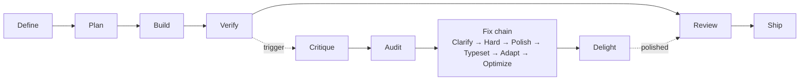

# Another Agent Skills

[](https://skills.sh/juandelossantos/another-agent-skills)
[](./RELEASE-NOTES.md)
[](./docs/skills.html)
[](./docs/skills.html)
[](./tests/run-all.sh)
[](./LICENSE)
[](./docs/AGENT-ADAPTERS.md)

**Most skill libraries sell capability. We sell discipline you can verify.**

58 composable skills and mechanical enforcement that turn AI coding agents into disciplined senior engineers. No bloat. No shortcuts. Just process. Harness. Repeat.

Define → Plan → Build → Verify → Review → Ship. Every time.

**Start with [`/gate`](./skills/gate/SKILL.md).** The entry-point skill wires the enforcement into any repo — local hooks, a TDD gate, and a required CI check — then proves the first gate actually fires. Install it with `npx @juandelossantos/another-agent-skills install`.

> Designed for [**OpenCode**](https://opencode.ai) first. Portable to Claude Code, Cursor, Codex, Gemini CLI, GitHub Copilot, and any agent that reads `AGENTS.md` — see [`docs/AGENT-ADAPTERS.md`](./docs/AGENT-ADAPTERS.md).

---

## Proof, not promises

Most agent skill frameworks give you a library of prompts. This one gives you an engineering discipline with mechanical enforcement.

- **L1 — local hooks** (`.git/hooks/*`). Fast, advisory feedback. A code change with no matching test is blocked before it leaves your machine.
- **L2 — required remote `gates` check** (`.github/workflows/gates.yml`). The TDD gate and the full test suite run as a required status check on `main`. The committer cannot skip it. **GitHub only.**
- **L3 — `CODEOWNERS`.** The gate configuration is owned by a human, so a PR cannot edit its own rules.

A real blocked commit:

```text
$ git commit -m "feat: add checkout"
[commit-msg v6] scanning staged files
[commit-msg v6] code changed: src/checkout.js
[commit-msg v6] matching test: none
✗ BLOCKED: every code change needs a matching test.
```

The same check runs remotely as the required `gates` status, so it cannot be bypassed by the committer. The agent never runs `git commit` or `git push`; the human does. See the [remote enforcement evidence](./docs/REMOTE-ENFORCEMENT-EVIDENCE.md).

---

## What's New in v6.3.0

**Remote enforcement, distribution, and the public web.** One release covering Phase 8, 8.1, 9, and 10.

- **Remote enforcement (Phase 8)** — branch protection on `main` plus a required `gates` status check (`.github/workflows/gates.yml`) and `CODEOWNERS` (L3), so a PR cannot edit its own rules without review.
- **TDD-gate delivery + git/GitHub flows (Phase 8.1)** — the gate and the four supported setups (no git, local git, git + GitHub, git later) ship to user projects.
- **Distribution (Phase 9)** — pinned, attested releases and a checksum-verified `curl` bootstrap; the `aas` CLI (`install` / `upgrade` / `doctor` / `uninstall`); portable projects with no absolute symlinks; an npm wrapper (live) with OIDC trusted publishing.
- **The public web (Phase 10)** — a bilingual (EN/ES) Astro landing + docs site in [`web/`](./web/): the generated skills reference (58 skills / 153 guides), five tutorials, SEO/AEO (`sitemap`, `robots.txt`, `llms.txt`, JSON-LD) and a WCAG 2.2 AA gate.
- **Docs honesty** — the guide count was corrected from 74 to 151, and the L1/L2/L3 model and INCIDENT_004 were corrected.
- **Honest status** — **npm is live** (`@juandelossantos/another-agent-skills`) and the `web/` site is **live** at <https://juandelossantos.github.io/another-agent-skills/>.
- **Tests** — the core suite plus the `web/` build and `node --test` suite and the Playwright + axe accessibility gate, all green.

Older releases live in [`RELEASE-NOTES.md`](./RELEASE-NOTES.md) and the [GitHub Releases](https://github.com/juandelossantos/another-agent-skills/releases).

---

## Install

**Recommended — the npm channel.** One command installs the full harness: the 58 skills **and** the mechanical gates (local hooks, the TDD gate, and the required CI check).

```bash
npx @juandelossantos/another-agent-skills install
```

**Skills only — the ecosystem CLI.** Installs just the skills into your agent, no harness, no clone:

```bash
npx skills add juandelossantos/another-agent-skills
```

**Install once per machine, use it in any project.** The harness is portable (no absolute symlinks) and the installer detects your shell, your agent, and your stack, then wires the matching skills and gates.

### 1. Clone + installer (live)

```bash
git clone https://github.com/juandelossantos/another-agent-skills.git
cd another-agent-skills
bash install.sh          # installs the 58 skills globally and configures your shell
init-agents              # in any project: activates skill-driven mode
```

Windows (PowerShell): `.\install.ps1`. The installer detects Zsh, Bash, Fish, or PowerShell and configures it automatically.

> **Platform note:** the Phase-7 installer flags (`--skills-only`, `--guardrails-only`, `--plugin-only`, multi-agent detection and version gating) are **POSIX-only** (`install.sh`). `install.ps1` provides Claude Code parity (global skills + hook wiring) but **not yet these flags**; on Windows use the Bash installer (WSL / Git Bash) until parity lands.
>
> **Only use Claude Code?** `bash install.sh --agent claude` installs the 58 skills to `~/.claude/skills/` (Claude Code's own global path — auto-discovered in every project, no `init-agents` needed) plus `CLAUDE.md` and the enforcement hooks, without setting up OpenCode.

### 2. Pinned `curl` bootstrap (live)

```bash
curl -fsSL https://github.com/juandelossantos/another-agent-skills/releases/latest/download/bootstrap.sh | bash
aas install --agents auto     # activate in the current project
aas doctor                    # environment report
aas upgrade                   # self-update from the latest pinned release
aas uninstall                 # remove the CLI, install root, and PATH entry
```

Installs a **pinned, checksum-verified** release tarball (never a mutable branch) and links the `aas` CLI. `--version vX.Y.Z` pins an exact release; `--dry-run` prints every action without writing anything. The install root is `${XDG_DATA_HOME:-$HOME/.local/share}/another-agent-skills` (override with `AAS_HOME`).

### 3. npm (live)

```bash
npx @juandelossantos/another-agent-skills install
```

The wrapper ships no payload; it downloads and verifies the same release. Published via OIDC trusted publishing (no stored token).

All channels, the maintainer one-time setup, and the release/npm automation are documented in [`docs/DISTRIBUTION.md`](./docs/DISTRIBUTION.md). The public site and docs are built from [`web/`](./web/) and are **live** at <https://juandelossantos.github.io/another-agent-skills/>.

---

## What it is: the Harness

> *"A raw model is not an agent. It becomes one once a harness gives it state, tool execution, feedback loops, and enforceable constraints."*
> — Osmani, Saboo & Kartakis, *The New SDLC With Vibe Coding*, 2026

**Agent = Model + Harness.** Most agent failures blamed on "the model" are configuration failures: missing tools, vague rules, absent guardrails, noisy context. This project is a complete open-source implementation of the Harness.

| Component | What It Is | In This Project |
|---|---|---|
| **1. Instructions & Rules** | Who the agent is, what it cares about, what it must never do | `AGENTS.md`, `SOUL.md`, `STEERING-GUIDE.md` |
| **2. Tools** | Task-specific capabilities loaded on demand | 58 skills in `skills/`, 153 guides, eval system |
| **3. Sandboxes & Execution** | Where the agent's code actually runs | Terminal, git workspace, CI |
| **4. Orchestration** | When each tool fires and how agents coordinate | `skill-gate.sh`, `init-agents.sh`, multi-agent skill |
| **5. Guardrails & Hooks** | Deterministic enforcement at lifecycle points | Pre-commit v11 (15 gates including Gate 0 and the Test Runner), commit-msg v6 (TDD gate, no override) |
| **6. Observability** | Evidence it works or is quietly drifting | `project-metrics`, `HEALTH-CHECK.md`, `PROGRESS_STATUS.md` |

Beyond prompts, the framework also ships a portable agent identity (`SOUL.md`), the **Guardian Pattern** (a DECISION POINT before every mutation — plan approval is not commit approval), lazy context loading (**~3,870 tokens always-loaded** vs ~7,965 eager), and stack-agnostic setup (`init-agents` writes `STACK_CONFIG.md`).

[**Full Harness architecture →**](./docs/HARNESS.md)

---

## The lifecycle

Every task runs **Define → Plan → Build → Verify → Review → Ship**. No phase is optional, and each one has an exit criterion. After Verify, the design review pipeline runs critique → audit → fix → delight before shipping.


```mermaid
flowchart LR
    DEF[Define] --> PLAN[Plan] --> BUILD[Build] --> VER[Verify] --> REV[Review] --> SHIP[Ship]
    VER -. "trigger" .-> CQ[Critique] --> AQ[Audit] --> FX["Fix chain<br/>Clarify → Hard → Polish → Typeset → Adapt → Optimize"] --> DX[Delight] -. "polished" .-> REV
```

[**Full lifecycle docs →**](./docs/lifecycle.html) · [**Design workflow →**](./docs/DESIGN-WORKFLOW.md)

---

## Skills

58 composable skills, each declaring its output contract (artifact, format, location, quality), when to use it, and when **not** to.

| Skill | When | What It Does |
|---|---|---|
| `gate` | **Enforcement** | Wire mechanical gates (local hooks + TDD gate + required CI check) into any repo; prove the first gate fires |
| `engineering-fundamentals` | Foundation | Universal engineering philosophy: discovery, contracts, anti-slop, quality gates |
| `spec-driven-development` | New features | Research-backed specs with critical thinking |
| `architecture-analysis` | Stack decisions | 2-3 options evaluated with trade-offs |
| `backend-api-mastery` | API / backend | REST/GraphQL, DB, auth, testing, docs |
| `test-driven-development` | Build | RED-GREEN-REFACTOR, enforced by the TDD gate |
| `code-review-and-quality` | Review | Five axes: correctness, readability, architecture, security, performance |
| `security-and-hardening` | Review | OWASP prevention, input validation, auth, data storage |
| `debugging-three-strikes` | Stuck | Stop speculative fixes after three same-bug strikes |
| `shipping-and-launch` | Deploy | Pre-launch checklist, monitoring, rollback, TOOL_GAP |
| `fullstack-shipping` | Go-live | CI/CD, orchestration, monitoring, launch |
| `multi-agent-orchestration` | >2 agents | Parallel / pipeline / swarm patterns |
| `self-improvement` | Background | Detect → diagnose → fix with human approval |

**Full catalog (58 skills, grouped by lifecycle phase) →** the [skills reference](./docs/skills.html) (in-repo) or the [new Astro docs](https://juandelossantos.github.io/another-agent-skills/docs/skills/) (live) · [**Meta-Skills Guide →**](./docs/META-SKILLS-GUIDE.md)

---

## Git & GitHub Workflows

`init-agents` adapts to what your project actually has. Enforcement has three layers, and they arrive as your project grows:

- **L1 — local hooks** (`.git/hooks/*`): fast feedback, advisory. Installed only when `.git` exists.
- **L2 — remote `gates` required check** (`.github/workflows/gates.yml` + branch protection): the authority.
- **L3 — `CODEOWNERS`**: protects the gate config.

**L2 and L3 are GitHub-only.** Without GitHub you still get skills, rules, and L1 hooks — the workflow is first-class, not degraded.

### 1. no-git — independent / private, no VCS

`init-agents` still installs rules, skills, and `AGENTS.md`, but there are no hooks and no remote gate. Enforcement is **convention-only**. To enable more: run `git init`, then **re-run `init-agents`** (it installs the local hooks); add a GitHub remote for L2.

### 2. local-git — local git, no remote (private repo or another forge)

L1 hooks are active. **There is no L2/L3.** To get remote enforcement: add a GitHub remote (`git remote add origin …`) and **re-run `init-agents`**, then run `scripts/setup-branch-protection.sh`.

### 3. git + GitHub — full L1 + L2 + L3

1. `init-agents` — installs the hooks, `.github/workflows/gates.yml`, and `scripts/setup-branch-protection.sh`.
2. Commit and push a branch and open a PR so the `gates` check reports at least once.
3. `bash scripts/setup-branch-protection.sh --dry-run` — preview (no writes).
4. `bash scripts/setup-branch-protection.sh` — apply (needs `gh` authenticated with admin).
5. Verify: `gh api repos/OWNER/REPO/branches/main/protection`.

### 4. git-later — no git now, git (+ GitHub) later

The key rule: **re-run `init-agents` after `git init` and after adding the remote.** It detects what is now available and installs the missing layers (hooks, `gates.yml`).

[**Branch protection guide →**](./docs/BRANCH-PROTECTION.md) · [**Tutorials →**](https://juandelossantos.github.io/another-agent-skills/docs/) (live)

---

## Quick Start

```bash
init-agents          # new or existing project: activates skill-driven mode
```

`init-agents` merges `AGENTS.md` without overwriting existing rules, links the framework files, detects your stack and creates `STACK_CONFIG.md`, installs the lifecycle enforcement hook (tests, build, secrets), installs the CI pipeline, and creates `.sessionrc` for purpose-driven sessions.

**Safety:** it backs up before replacing and merges — never overwrites. **Universal:** works with Node, Rust, Python, Go, Ruby, Dart, or any stack.

Before editing in this repo: `bash scripts/pre-flight.sh` (checks branch, clean tree, remote state).

**New to skills?** Read the [**Quick Start Guide →**](./docs/quickstart-guide.html) ([Markdown](./QUICKSTART.md)).

---

## Agent Compatibility

Another Agent Skills works with multiple AI coding agents. **Git hooks work everywhere.**

| Feature | OpenCode | Claude Code | Cursor | Codex | Gemini CLI | Any git agent |
|---|---|---|---|---|---|---|
| 58 skills installed globally | ✅ auto → `~/.config/opencode/skills/` | ✅ auto → `~/.claude/skills/` | ⚠️ manual | ⚠️ manual | ✅ auto → `~/.gemini/skills/` | ⚠️ manual |
| Git hooks (pre-commit, commit-msg) | ✅ auto | ✅ auto | ✅ auto | ✅ auto | ✅ auto | ✅ auto |
| Manifest gate (`commit-approval.sh` + `log-test-results.sh`) | ✅ auto | ✅ auto | ✅ auto | ✅ auto | ✅ auto | ✅ auto |
| `SOUL.md` + `AGENTS.md` rules | ✅ auto | ⚠️ manual | ⚠️ manual | ⚠️ manual | ⚠️ manual | ⚠️ manual |
| Skill concepts (TOOL_GAP, severity) | ✅ auto | ⚠️ manual | ⚠️ manual | ⚠️ manual | ⚠️ manual | ⚠️ manual |
| i18n (EN/ES) | ✅ auto | ❌ N/A | ❌ N/A | ❌ N/A | ❌ N/A | ❌ N/A |

**Setup per agent →** [`docs/AGENT-ADAPTERS.md`](./docs/AGENT-ADAPTERS.md). The installer detects 15 agents, version-gates them, and installs the matching skills and guardrails.

### Using the principles in your own system

| Principle | How to use |
|---|---|
| **Harness** | Every agent feature needs a mechanical component, not just a prompt. If it can fail, it needs a gate. |
| **TOOL_GAP** | When verification tools can't reach the world, report "ship status unknown." Never fake success. |
| **Error path design** | Every tool call, gate, and loop needs a failure path designed at build time. |
| **Continuation over recap** | After context loss, resume from the last known state. Don't re-explain everything. |
| **Drift detection** | Check docs vs reality regularly: stats, versions, features, commands, links. |
| **Manifest gate** | Require a written summary of changes before any commit approval. |

---

## Documentation

The public site and docs are built from [`web/`](./web/) (Astro, bilingual EN/ES). They are **live** at <https://juandelossantos.github.io/another-agent-skills/>.

| Source | What it is |
|---|---|
| [`web/src/content/docs/`](./web/src/content/docs/) | The new docs: overview, getting started, lifecycle, skills, enforcement, agents, distribution, branch protection, FAQ |
| [`web/README.md`](./web/README.md) | How the Astro site is built, structured, and tested |
| [`docs/HARNESS.md`](./docs/HARNESS.md) | Harness architecture: 6 components, Agent = Model + Harness |
| [`docs/DISTRIBUTION.md`](./docs/DISTRIBUTION.md) | All install channels, maintainer setup, release automation |
| [`docs/AGENT-ADAPTERS.md`](./docs/AGENT-ADAPTERS.md) | Agent compatibility, adapter setup, per-agent configuration |
| [`docs/BRANCH-PROTECTION.md`](./docs/BRANCH-PROTECTION.md) | L2/L3 setup and the honest limits of remote enforcement |
| [`docs/quickstart-guide.html`](./docs/quickstart-guide.html) · [`QUICKSTART.md`](./QUICKSTART.md) | Your first session, how skills activate, day-to-day tips |
| [`AGENTS.md`](./AGENTS.md) · [`AGENTS-EXTENDED.md`](./AGENTS-EXTENDED.md) | Core rules; anti-rationalization table and project-type matrix |
| [`SOUL.md`](./SOUL.md) · [`STEERING-GUIDE.md`](./STEERING-GUIDE.md) | Project identity and the canonical files the agent must know |
| [`GLOSSARY.md`](./GLOSSARY.md) · [`PATTERNS.md`](./PATTERNS.md) · [`ANTI-PATTERNS.md`](./ANTI-PATTERNS.md) | Terms, workflow patterns, and 11 agent anti-patterns |
| [`PROGRESS_STATUS.md`](./PROGRESS_STATUS.md) · [`RELEASE-NOTES.md`](./RELEASE-NOTES.md) · [`HEALTH-CHECK.md`](./HEALTH-CHECK.md) | State, changelog, health audit |
| [`DEVELOPMENT.md`](./DEVELOPMENT.md) | Maintainer conventions and artifact rules |
| [ADRs/](./ADRs/) | Architecture Decision Records |

**When the site is live it will serve:** [landing](https://juandelossantos.github.io/another-agent-skills/) · [docs](https://juandelossantos.github.io/another-agent-skills/docs/) · [skills reference](https://juandelossantos.github.io/another-agent-skills/docs/skills/) · [tutorials](https://juandelossantos.github.io/another-agent-skills/docs/first-gated-commit/) · [`llms.txt`](https://juandelossantos.github.io/another-agent-skills/llms.txt).

---

## Testing & quality

```bash
bash tests/run-all.sh
```

The runner auto-discovers every `tests/test-*.sh` suite (behavioral and regression) plus the task working set, the audit engine, the init scaffolding, skill lint, and the eval end-to-end suite. It also runs as **Pre-commit Gate 14**, scoped to changed files.

**TDD gate rules** — the gate verifies each staged artifact **by type**, with no override:

- **Code** (`scripts/*.sh`, `src/*.ts`, …): a **name-paired** test (`scripts/tdd-gate.sh` → `tests/test-tdd-gate.sh`), **non-empty** (it must assert on behavior, not just exist), **new** (not in `HEAD`), and created **before** the code (staging order, RED → GREEN).
- **Docs** (`.md`): the **docs-honesty** validator — a broken internal link **blocks**; cited paths and placeholders are advisory.
- **Config** (`.json`/`.yaml`/`.toml`): the **config-consistency** validator — invalid syntax, or a `package.json` script pointing at a missing file, **blocks**.
- **Shims** (`.sh` delegating to the framework): a name-paired test that actually **invokes** the shim (installed `.husky/*` shims stay exempt).
- **No override:** there is no bypass; `.aas/tdd-ignore` is the only conscious, per-project escape.

The `web/` Astro site has its own build + `node --test` suite and a Playwright + axe WCAG 2.2 AA gate, run separately — the core CI never builds it. See [`web/README.md`](./web/README.md).

---

## Contributing

Pull requests are welcome. Whether it's a new skill, a guide improvement, or a bug fix — the bar is quality, not complexity.

1. Fork the repo.
2. Add or improve a skill in `skills/`.
3. Follow lazy loading: `SKILL.md` as the index, `*-GUIDE.md` for details.
4. Keep it tight: no filler, no duplication, imperative voice.
5. Test with `bash install.sh`.
6. Open a PR.

**Guides and conventions:** [`DEVELOPMENT.md`](./DEVELOPMENT.md) covers the artifact convention (`development/` is git-ignored), skill templates, and the review process. **Blocked on something?** [Open an issue](https://github.com/juandelossantos/another-agent-skills/issues).

---

## Uninstall

```bash
# Linux / macOS — removes shell config, scripts, skills, and the remote repo
bash uninstall.sh

# Windows
.\uninstall.ps1
```

Does not remove your user profile (`~/.config/opencode/user-profile.json`) or this repository.

## Requirements

- **Git** + **Bash** (Linux/macOS) or **PowerShell** (Windows)
- **OpenCode** recommended. Adapters available for Claude Code, Cursor, Codex, Gemini CLI, and any agent that reads `AGENTS.md`.

---

## Prior Art & Credits

Ideas borrowed from the ecosystem, adapted to fit our philosophy. We don't copy. We synthesize.

| Source | What We Took | How We Adapted |
|---|---|---|
| [Singhal et al. — *Agent Skills* (Google, 2026)](https://drive.google.com/file/d/1Wso-CM4aAvTxFZa5wjBntKM3IVSg7PWW/view) | EDD (Evaluation-Driven Development), 4 failure modes, Read/Draft/Act tiers, eval toolkit (5 patterns), meta-skills, skill smells | Created the v2.0.0 eval framework (`scripts/eval/`), skill tier system in frontmatter, smells detection in skill-lint.sh, 14 new skills completing the lifecycle pipeline |
| [Addy Osmani](https://github.com/addyosmani/agent-skills) | 23 upstream skills as foundation | Expanded to 57 skills with lazy loading, guides, enforcement, and evaluation |
| [Osmani, Saboo & Kartakis — *The New SDLC With Vibe Coding*](https://drive.google.com/file/d/1wNEl8FMpTso8aXlb_joxgzparxi-0ciM/view) (2026) | Harness engineering, factory model, agentic engineering spectrum | Created `docs/HARNESS.md`, reframed enforcement as "The Harness", added the AI review checklist |
| [github/spec-kit](https://github.com/github/spec-kit) (2026) | Structured clarification before planning, convergence checks, research artifacts, parallel task markers | Added P2 Clarification + P10 Convergence to `spec-driven-development`, the `architecture/research.md` artifact, `[S]/[P]/[Pm]` markers |
| [Affaan Mustafa / ECC](https://github.com/affaan-m/ECC) | Cross-platform enforcement, SOUL.md pattern, shared-memory gap analysis | Created `SOUL.md`, mechanical enforcement, incident-driven evolution |
| [Sub-Zero Skill](https://github.com/henchmarketing-rgb/sub-zero-skill) | TOOL_GAP verdict, fresh-context verification, drift detection | Added to SOUL.md principle 8, Rule 0h, `code-review-and-quality`, `project-health-check`, `shipping-and-launch` |
| [awesome-skills/code-review-skill](https://github.com/awesome-skills/code-review-skill) | 6-level severity labels | Added to `code-review-and-quality` |
| [Harness Books](https://github.com/wquguru/harness-books) | Error path design, continuation-over-recap, 10 principles of harness engineering | Added to `engineering-fundamentals`, Rule 0i, `SOUL.md` |
| [Leonxlnx / taste-skill](https://github.com/Leonxlnx/taste-skill) | Design taste and anti-slop frontend | Integrated into `critique-skill` and the design review pipeline |
| [Paul Bakaus / impeccable.style](https://impeccable.style) | Design review pipeline inspiration | Built the 9-skill pipeline: critique → audit → fix → delight |
| [Julius Brussee / caveman](https://github.com/JuliusBrussee/caveman) | Token optimization inspiration | Lazy loading, 250-line skill indexes, 60/25/15 context budget |
| [OpenCode team](https://opencode.ai) | Native skill framework and invocation system | Built OpenCode-first, portable to other agents |

---

## License

MIT © 2026 juandelossantos
